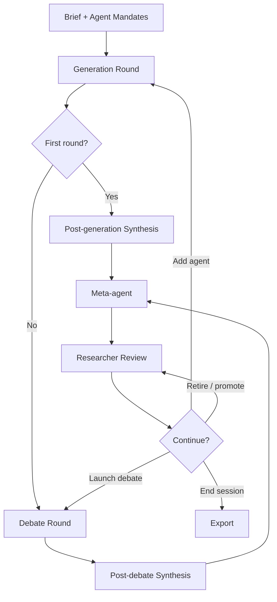
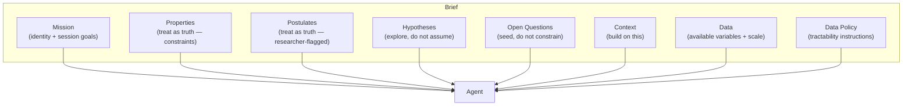
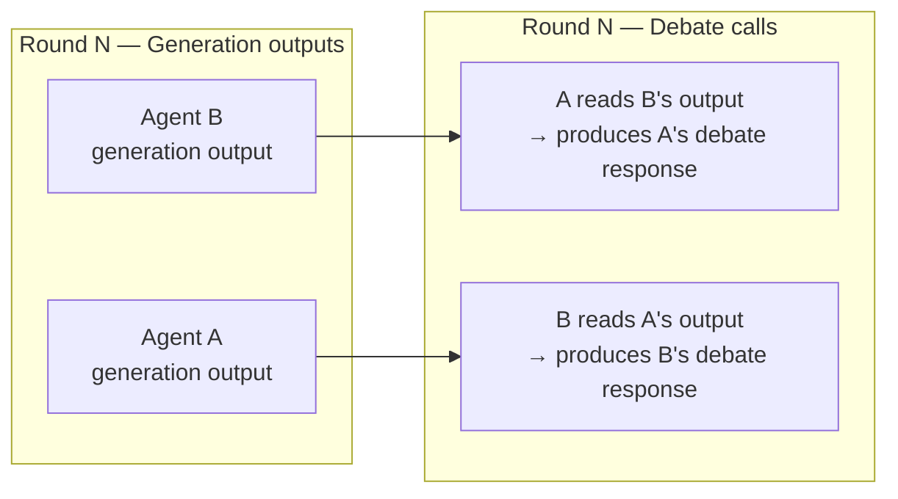
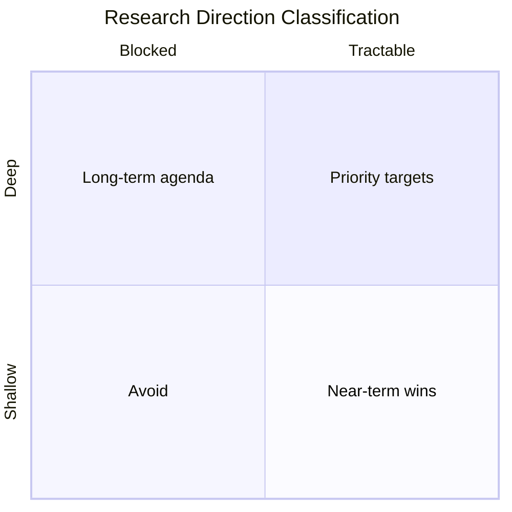
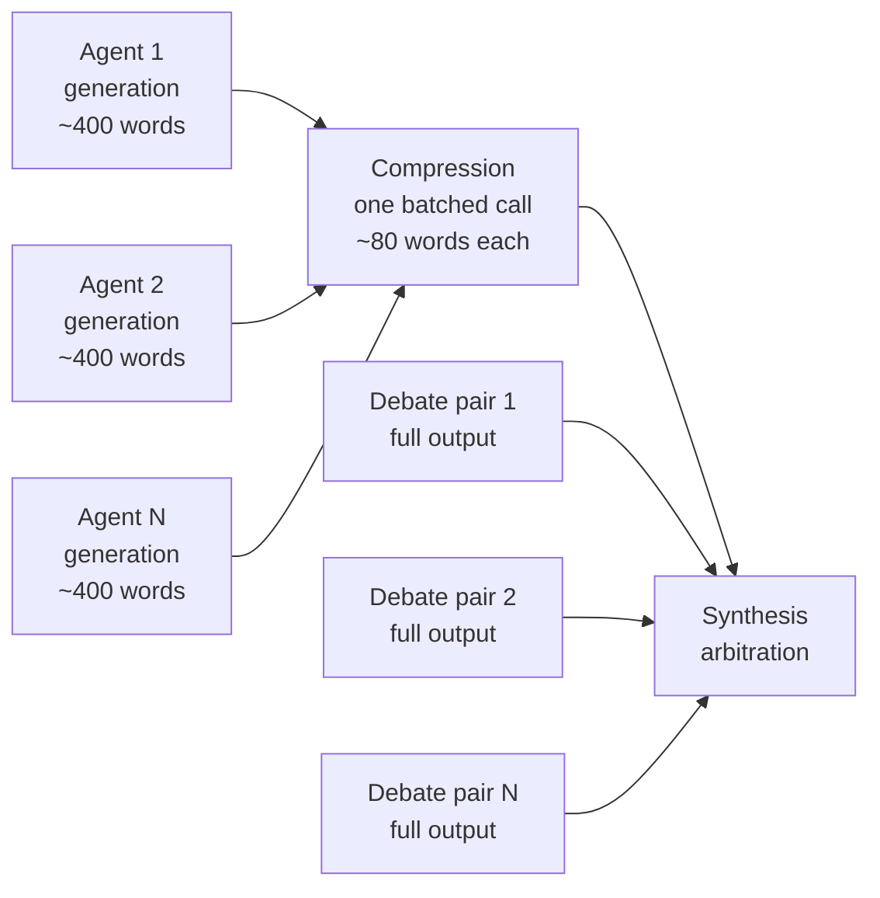
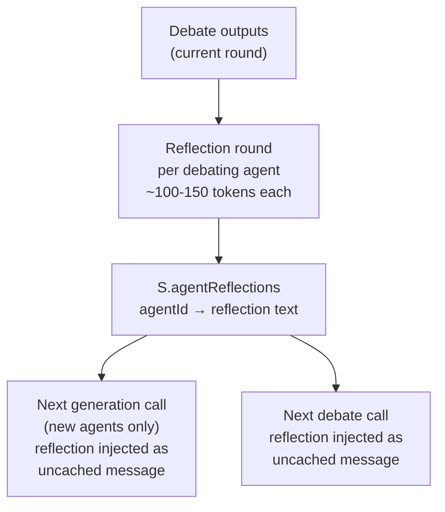

# Research Swarm — Methodology and Design

*A document for understanding what we have built, why we built it this way, and where it is going.*

---

## 1. What problem are we solving?

Theoretical research in complex domains — especially early-stage interdisciplinary work — suffers from a specific failure mode: **premature convergence on a single framing**. A researcher working alone, or a homogeneous group, tends to explore the neighbourhood of their existing conceptual commitments. Adjacent disciplines that would reframe the problem are consulted late if at all. Productive tensions between incommensurable frameworks go unnoticed.

Research Swarm is an attempt to use heterogeneous AI agents to **systematically explore a theoretical landscape** rather than converge on a single answer. The goal is not a correct answer — it is a structured map of the space: what ideas converge independently, where frameworks conflict, what each framework cannot see, and which directions are both deep and tractable.

The domain is arbitrary. The methodology is not.

---

## 2. Session lifecycle overview

A session proceeds in repeating cycles. Each cycle consists of four stages:



The researcher intervenes between every major stage. The system is **not autonomous** — it is a structured environment for researcher-guided exploration. This is a deliberate design decision discussed in section 6.

---

## 3. The brief and agent mandates

### 3.1 The brief

The brief is the single most important lever in the system. It is the shared epistemic ground sent identically to every agent on every call throughout the session. Its content directly determines what the swarm explores.

#### Current structure

The brief currently consists of three editable fields:

| Field | Purpose |
|---|---|
| **Problem context** | Describes the system under study: what it is, how it works, known properties, and a general mandate for agents. |
| **Research context** | What is already known, which frameworks exist, prior results and ideas to build on. May include the researcher's own initial theoretical contributions. |
| **Available data** | What datasets are accessible, what variables are measurable, and what data-access instructions agents should follow. |

This structure was chosen to cover the essentials for a first working system. It is sufficient but not fully principled — the current fields conflate several conceptually distinct kinds of information in ways that limit the researcher's control over how agents treat different claims.

#### The researcher's role in authoring the brief

The brief encodes the researcher's best current understanding of the domain. The intellectual choices — what to include, what level of abstraction to use, which postulates to accept — must come from the researcher. The actual drafting can involve AI assistance (for example, using a separate conversation to synthesise a concise research context from multiple source materials), as long as the researcher directs what is included and why.

This is important: the brief is not a neutral description. It is the researcher's intellectual stake in the session — the frame within which all agent outputs are anchored.

#### Why a shared brief rather than specialised contexts?

All agents operate in the same epistemic world. A Bayesian modeller and an evolutionary dynamicist are both trying to explain the same phenomenon. Giving them specialised contexts would allow them to talk past each other; giving them the same context forces them to compete on the same terrain, making genuine disagreements legible.

#### A known tension: known facts vs. postulates

The Problem Context field currently mixes two epistemically distinct kinds of claims:

- **Known properties**: empirically established facts about the system (e.g. "Only climbers who successfully complete a route can propose a grade")
- **Postulates**: claims the researcher believes to be true but has not verified (e.g. "Personal grade proposals are biased by the known consensus grade")

Both are stated as facts, and agents treat them as such. This is sometimes intentional: accepting a postulate as true allows agents to hypothesise *on top of it*, which can generate interesting theoretical directions the researcher would not have anticipated. The alternative — flagging postulates explicitly — would cause agents to address the postulate's validity rather than its implications, shifting the session toward empirical testing rather than theoretical development.

However, there is also a risk: a false postulate accepted as truth can lead the swarm to collectively develop models with a flawed foundation. The researcher must be aware of which claims are genuinely established and which are working assumptions.

The current design leaves this tension unresolved. A more principled brief structure, described below as a future direction, would give the researcher explicit control over how agents treat different claims.

#### Future direction — a richer brief structure (issue #10)

The current three-field structure is a pragmatic first approximation. A more principled design would distinguish the following sections:

**Mission** — the session's identity and goals. Contains the domain framing ("You are a research specialist contributing to a multi-agent theoretical exploration of X"), the general mandate ("Be specific, technically rigorous, and propose directions that would constitute genuine scientific contributions"), and any session-level orientations ("prioritise tractable directions", "focus on theoretical unification rather than empirical testing"). This is boilerplate in the sense that it wraps all other content, but it is the right place for explicit session goals that currently have no dedicated home.

**Properties** — known facts about the system, treated as constraints. Agents should be instructed to treat these as ground truth: their models should be consistent with Properties. Example: "Only climbers who successfully complete a route can propose a grade."

**Postulates** — beliefs the researcher holds but has not verified, also treated as constraints by agents but flagged for the researcher's benefit. Agents treat Postulates identically to Properties; the separation is for the researcher's own clarity about what the swarm is building on. Example: "Personal grade proposals are biased by the known consensus grade and recent proposals."

**Hypotheses** — propositions the researcher suspects are true and wants the swarm to explore. Unlike Properties and Postulates, agents are explicitly instructed *not* to take Hypotheses as given — instead, they should treat them as propositions that theoretical frameworks might support, refute, or reframe. Agents should note when their framework has implications for a listed hypothesis, but are not required to address every hypothesis. Example: "Do interactions between anchoring and selection bias lead to grade inflation?"

**Open Questions** — research questions the researcher is interested in, stated without a presumed answer. Same treatment as Hypotheses: agents are not required to address them and should be free to propose entirely different questions. The purpose is to seed the swarm's exploration without constraining it. Example: "Is climbing difficulty a well-defined scalar, or do rank-reversal effects provide evidence of genuine multidimensionality?"

**Context** — frameworks, prior results, and theoretical ideas to build on. May span multiple disciplines and may include the researcher's own prior work or initial theoretical contributions. Not restricted to theoretical content — empirical context is equally valid here.

**Data** — what datasets are accessible, what variables are available, the scale and geographical coverage of the data, and any relevant sampling biases.

**Data Policy** — instructions for how agents should reason about data in their proposals. A default policy might be: "Treat research directions requiring the listed datasets as tractable. Flag any direction requiring data not listed above as requiring new data collection. Purely theoretical directions that do not require the listed data are also welcome." The researcher can edit this policy to shift the session's orientation — for example, restricting to empirically testable directions only, or allowing freely speculative theoretical work.



The key design insight is that **the same information, placed in different sections, gives agents different instructions about how to treat it**. A claim in Properties is a constraint; the same claim in Hypotheses is an invitation to explore. The section structure is a lightweight formal language for the researcher's epistemic intentions.

This richer structure also makes the tension between exploration and grounding explicit and navigable: Properties and Postulates ground the swarm; Hypotheses and Open Questions open it. The researcher controls the balance by deciding where to place each claim.

*This is a future direction, not the current implementation. See issue #10.*

### 3.2 Agent mandates

Each agent has a mandate: a ~120-word statement of its disciplinary identity. The mandate specifies which frameworks, methods, and formal tools the agent brings to the problem. It does not prescribe what conclusions the agent will reach.

Mandates are **immutable during a session**. This is a hard design constraint, discussed in detail in section 7.1.

**What makes a good mandate?**
A good mandate is:
- **Technically specific**: names actual frameworks and methods (Fokker-Planck equations, hierarchical Bayesian models, Price equation) rather than vague disciplinary labels
- **Framing-complete**: tells the agent not just *what tools* to use but *what kinds of questions* its toolkit is suited to answer
- **Honest about scope**: the best mandates include what the framework *cannot* do as well as what it can — this seeds self-awareness in debate

A poor mandate is one that is too broad ("applies statistical methods") or too narrow ("computes Jaccard similarity"). The former produces generic outputs; the latter produces outputs that cannot engage with the broader landscape.

---

## 4. Generation round

### 4.1 What happens

Each active agent receives:
- The full brief (shared, cached)
- Its individual mandate (uncached, unique per agent)
- A depth instruction

The depth instruction controls word count and analytical stance:

| Depth | Words | Instruction character |
|---|---|---|
| Brief | ~180 | Prioritise tractability; one sentence per direction |
| Detailed | ~320 | Identify model, key unknown, data requirement |
| Exhaustive | ~500 | Sketch equations; anticipate strongest objection; propose empirical test |

The output is the agent's independent theoretical contribution: 2–3 research directions proposed from within its disciplinary perspective, applied to the shared brief.

### 4.2 Independence as a design principle

Generation outputs are produced **completely independently**. Agents do not see each other's outputs during generation. This is the foundation of the system's value.

**Why independence matters:**
If agents saw each other's outputs during generation, the resulting outputs would reflect social influence rather than disciplinary difference. The heterogeneity of the swarm — which is the whole point — would be contaminated by anchoring effects before any structured debate had occurred. The independence of generation outputs is what makes the subsequent debate substantive rather than performative.

This is analogous to the Delphi method's first round, where panel members give independent estimates before seeing others' responses. The difference is that Research Swarm's "second round" is structured argumentation rather than simple aggregation.

### 4.3 Smart generation

After the first round, generation only runs for **newly added agents**. Existing agents' generation outputs are preserved across rounds. This reflects a design decision about where learning happens: agents do not regenerate from scratch each round; instead, the debate round is where new information is processed. The reflection round (section 9) will partially address this limitation.

---

## 5. Debate round

The debate round is the most architecturally distinctive part of the system. Its design involves several interrelated choices that are worth understanding in detail.

### 5.1 What a debate call contains

A debating agent receives:
- The full brief (shared, cached — same as generation)
- Its own mandate (uncached — same as generation)
- A single partner's **complete generation output**
- A debate instruction

The debate instruction is:

> *"You have read the output of [Partner]. Write a focused debate response (~N words): challenge assumptions, identify incompatible predictions, or show how combining both frameworks yields something neither could produce alone. Be direct, technically specific, and honest about where your own framework has limits."*

For batched multi-partner debates (when an agent has multiple partners in the same round), the instruction is adapted to request labelled responses to each partner.

### 5.2 Debate is unidirectional per call

Each debate call is **directed**: agent A reads B's generation output and responds to it. Agent B does not simultaneously read A's output. If both A→B and B→A are scheduled in the same round, they fire as separate calls, each reading only the other's *generation output* — not the other's debate response.



**Why unidirectional rather than conversational?**
A true multi-turn conversation between agents would require sequential execution (B cannot respond to A's debate response until A has produced it), would extend session time substantially, and would create a risk of rhetorical convergence — agents would respond to each other's *responses* rather than to each other's underlying theoretical positions. By anchoring debate to generation outputs, we ensure agents are always engaging with each other's disciplinary frameworks, not with each other's rhetorical moves.

The cost of this choice is that debate responses cannot build on each other within a round. This is a genuine limitation. The reflection round (section 9) is partly motivated by the desire to give agents some memory of what was argued, even if not within-round iteration.

### 5.3 Debate pair typing

The meta-agent assigns each pair a type. The four types encode qualitatively different productive relationships:

| Type | Meaning | When to use |
|---|---|---|
| **CONTRADICTION** | The two frameworks make incompatible predictions about the same phenomenon | Frameworks disagree — the tension is generative |
| **INTERSECTION** | The two frameworks approach an unexplored overlap from different directions | Neither has addressed the shared territory |
| **DISRUPTION** | One framework challenges assumptions that have gone unquestioned | Prevents premature consensus |
| **BRIDGE** | One framework is tractable, one is deep — connecting them could unlock progress | Links what is doable to what is important |

**Why typed pairings?**
The type shapes how the debating agent should orient its response. A CONTRADICTION pairing asks the agent to identify and sharpen incompatible predictions — the right move is to be specific about where the disagreement lies and what data would resolve it. A BRIDGE pairing asks the agent to find connections — the right move is to show how the tractable framework's results could inform the deep one. Without typing, agents would have to infer the productive stance from context, which is less reliable.

The types also give the researcher legible information about the structure of the theoretical landscape: if most pairings are CONTRADICTION, the field has irresolvable disagreements; if most are INTERSECTION, the landscape is largely unexplored common ground.

### 5.4 The critical/collaborative balance

The debate instruction deliberately pulls in two directions simultaneously:

- **Critical**: *"challenge assumptions, identify incompatible predictions"*
- **Constructive**: *"show how combining both frameworks yields something neither could produce alone"*
- **Self-limiting**: *"honest about where your own framework has limits"*

This is the "yes and" tension. A purely adversarial debate would produce rhetorical one-upmanship and no synthesis. A purely collaborative debate would produce agreement without intellectual progress. The instruction attempts to hold both simultaneously.

The "honest about limits" clause is the most important mechanism here. An agent instructed only to challenge would protect its framework defensively. An agent instructed to also acknowledge its own framework's limitations is forced into a more epistemically honest posture — one where engagement with another framework can genuinely reveal something rather than merely be deflected.

**Is the current balance right?**
This is an open question. The prompts have not been systematically evaluated against alternatives. Two failure modes are possible:

1. **Too agreeable**: agents say "interesting, and from my framework I would add..." without genuinely engaging the tension. The synthesis then looks convergent even where real disagreements exist.
2. **Too adversarial**: agents refuse to acknowledge any common ground. The synthesis captures tensions but not tractable paths forward.

The current prompt leans toward (1) being more likely than (2), because LLMs have a strong prior toward agreement. The "challenge assumptions" instruction pushes back against this, but a systematic comparison of debate prompt variants against session quality metrics would be valuable (see issue #3 — evaluation framework).

### 5.5 What debate does not do

Debate responses are produced once and stored. They are not:
- Shown back to the debated-against agent
- Used to update any agent's generation outputs
- Incorporated into any agent's mandate

This means agents learn nothing from being debated in the current implementation. Their generation outputs remain unchanged across rounds. The reflection round (section 9) addresses this directly.

---

## 6. Synthesis

### 6.1 What the synthesis agent does

After each round (generation or debate), a synthesis arbitration agent reads all relevant outputs and produces a structured summary. The synthesis prompt specifies exact sections with word limits:

```
CONVERGENCES (60 words max)
TENSIONS (80 words max)
MOST TRACTABLE FIRST STEP (50 words max)
BLIND SPOTS (40 words max)
RESEARCH DIRECTIONS (titles only, tagged by depth × tractability)
CONTRADICTIONS (structured format: agent1 vs agent2, claims A and B, resolution method)
```

**Why word limits?**
Synthesis agents without word limits produce padded, meandering outputs that dilute the signal. The limits force prioritisation. A synthesis that says "Bayesian and stochastic modellers agree on X" in one sentence is more useful than three paragraphs hedging the same point.

**Why structured sections rather than free-form?**
The sections encode what matters most about a theoretical landscape:
- **Convergences**: what is robustly agreed — safe to build on
- **Tensions**: where the real intellectual action is — productive disagreement
- **Tractable first step**: grounds the abstract in something actionable
- **Blind spots**: what is missing — often the most generative finding
- **Research directions**: classified by the depth/tractability matrix (see below)
- **Contradictions**: explicitly structured for downstream tracking and resolution

The depth/tractability classification of research directions is particularly useful:



DEEP+TRACTABLE directions are the priority: theoretically important and actionable now. DEEP+BLOCKED directions are worth tracking but cannot be pursued immediately. SHALLOW+TRACTABLE directions are near-term wins. SHALLOW+BLOCKED directions should generally be abandoned.

### 6.2 Two-stage synthesis for post-debate rounds

After a debate round, the synthesis agent receives both generation outputs and debate outputs. Generation outputs can be long (~320–500 words each at detailed/exhaustive depth). Passing all of them directly to synthesis would make the synthesis prompt unwieldy and expensive.

The solution is a two-stage pipeline:
1. **Compression**: a cheap model summarises each agent's generation output to ~80 words, preserving key technical claims
2. **Synthesis**: receives compressed generation summaries + full debate outputs



**Design decision — why compress generation but not debate?**
Generation outputs are compressed because the key signal — which frameworks are being proposed — is robust to summarisation. The nuance in debate outputs is different: debate is precisely about the *specific claims* that conflict, the *exact incompatibilities*, the *precise ways* frameworks diverge. Compressing debate outputs risks losing exactly the information that makes debate valuable. So debate outputs are passed in full.

**Known limitation**: compression introduces lossy summarisation. If a generation output makes a subtle but important point that is not captured in 80 words, that point will not reach the synthesis agent. Issue #2 (compression toggle) proposes a user-facing control to disable compression and compare synthesis quality directly.

---

## 7. Key design decisions and their rationale

### 7.1 Mandate immutability

Agent mandates do not change during a session, regardless of what happens in debate. An agent that is persuaded by a partner's argument cannot update its mandate to reflect that persuasion.

**Why?**
The value of the swarm comes from **maintained heterogeneity**. If mandates updated, agents would drift toward consensus over multiple rounds. After several rounds, a Bayesian modeller who repeatedly debates an evolutionary dynamicist might begin proposing evolutionary directions, losing the precise disciplinary difference that made the pairing productive in the first place. The swarm would homogenise.

Mandate immutability is the system's primary protection against this failure mode. The reflection round (section 9) is designed to give agents *contextual awareness* of what they have learned through debate — updating their working memory without touching their disciplinary identity.

**What is lost?**
A real researcher does update their methodological commitments based on encounters with other frameworks. Mandate immutability prevents agents from modelling this. It is a simplification that trades some realism for guaranteed diversity. Whether this trade-off is correct empirically is unknown — it would require a controlled comparison.

### 7.2 Researcher-steered pairings

The meta-agent proposes debate pairings, but the researcher reviews and can modify them before launching a debate round. The researcher can also toggle individual pairs on or off, adjust agent statuses, and add new agents at any point.

**Why not fully automated?**
Full automation would allow the system to run without human oversight, but would also allow it to drift. The researcher brings domain knowledge the system does not have: they know which proposed pairings reflect genuine theoretical tensions vs. superficial label overlap, which agents are producing redundant outputs, when a direction is not actually tractable given the available data, and when a new perspective is needed that the current roster cannot supply.

The researcher-steered architecture treats the human as an intelligent filter on the meta-agent's proposals, not as a passive consumer of the system's outputs. This is a deliberate choice: the system is a *tool for a researcher*, not an autonomous research agent.

**What is lost?**
Researcher steering introduces subjective bias. A researcher might consistently favour familiar frameworks or under-appreciate unfamiliar ones. An automated system with better proposals would not have this failure mode. The assumption is that, at the current stage of system development, researcher judgement is more reliable than automated selection — but this assumption should be revisited as the meta-agent improves.

### 7.3 Agent retirement and promotion

Agents can be retired (removed from all future rounds), designated generation-only (contributing to generation but excluded from debate), or promoted (a status flag indicating particularly productive agents). These are researcher decisions, informed but not compelled by the meta-agent's recommendations.

**Why retirement rather than indefinite inclusion?**
As a session progresses, some agents become less productive. An agent whose framework has been exhaustively explored — all its key claims expressed, engaged, and incorporated into synthesis — continues to consume compute without contributing new information. Retirement keeps the active roster focused on agents that are still generating signal.

**Why generation-only status?**
Some agents produce valuable generation outputs but are not productive debate partners — either because their framework is too distant from others to produce useful direct confrontation, or because their outputs are better used as background context than as debate targets. Generation-only status allows the researcher to preserve their contribution to synthesis without forcing unproductive debate pairings.

### 7.4 Typed debate vs. free-form pairings

Debate pairs are typed (CONTRADICTION, INTERSECTION, DISRUPTION, BRIDGE) by the meta-agent. An alternative would be to let the meta-agent propose untyped pairings and let the debating agents figure out the appropriate stance themselves.

**Why typing?**
The type is information passed from the meta-agent to the debating agent. It encodes the meta-agent's understanding of *why* this pairing is productive. A debating agent that knows its pairing is CONTRADICTION will look for incompatible predictions; one that knows it is BRIDGE will look for connections. Without typing, the debating agent would have to infer the productive stance, which is a harder problem and more likely to produce generic outputs.

The typing also gives the researcher legible information about the landscape structure when reviewing proposed pairings — a dense cluster of CONTRADICTIONs in one region of the agenda space is a different signal than a cluster of INTERSECTIONs.

### 7.5 Batched multi-partner debate

An agent can debate multiple partners in a single call. If the meta-agent proposes A→B and A→C, both can be handled in a single API call to agent A, which produces labelled responses to each partner.

**Why batch rather than separate calls?**
The primary motivation is cost: an agent call includes the full shared brief as a cached block. Batching multiple partner responses into one call means paying for the brief once rather than N times. For an agent with 3 partners, batching reduces the cost of those calls by approximately two-thirds.

**What is lost?**
A batched response may be shallower than three separate dedicated responses. The agent divides its token budget across multiple partners, so each individual response receives less attention. Whether this trade-off is worth it depends on whether depth per partner or breadth of engagement is more valuable. The current design favours breadth.

---

## 8. Comparison with Perspectra

Perspectra (Liu et al., 2025, CHI 2026) is the closest comparable system in the literature. Both use LLM agents assigned expert personas to support interdisciplinary research ideation. The differences are instructive.

| Dimension | Perspectra | Research Swarm |
|---|---|---|
| **Human involvement** | Per-message (researcher @-mentions agents into threads, responds inline) | Per-round (researcher reviews between rounds, not within) |
| **Debate structure** | Open-ended forum threading; ISSUE, CLAIM, SUPPORT, REBUT, QUESTION moves | Typed directed pairings; CONTRADICTION, INTERSECTION, DISRUPTION, BRIDGE |
| **Target** | Individual idea refinement — researcher's existing proposal gets better | Landscape mapping — the space of directions gets clearer |
| **Agent memory** | Thread-persistent within session (agents see prior thread context) | Static generation output as anchor; no within-round memory |
| **Synthesis** | Human sensemaking via mind map visualisation | Automated arbitration agent producing structured synthesis |
| **Scale** | Small number of agents in reactive discussions | Larger roster in simultaneous parallel calls |
| **Output** | Revised research proposal | Structured map: convergences, tensions, blind spots, classified directions |

The most fundamental difference is the **granularity of researcher intervention**. Perspectra places the researcher inside the debate, steering message-by-message. Research Swarm places the researcher between rounds, steering at the level of roster and pairing decisions. Perspectra is better for developing a specific idea the researcher already has; Research Swarm is better for mapping a space the researcher is trying to understand.

Perspectra's finding that structured adversarial discourse (ISSUE/REBUT moves) significantly increases critical thinking compared to group-chat baseline supports the core assumption of Research Swarm — that typed, structured debate produces better outputs than free-form discussion. Their empirical evidence also suggests that user control over agent selection (which Research Swarm implements via the roster and pairing review) is a key driver of quality.

---

## 9. The reflection round (planned)

*Issue #5 — not yet implemented.*

### 9.1 The problem being solved

In the current system, agents produce generation outputs once and carry them unchanged through all subsequent rounds. The meta-agent reasons about potentially stale directions. Agents that have been debated extensively never incorporate what they learned from debate into their subsequent outputs.

This is a significant limitation. After a productive debate between the Bayesian and evolutionary frameworks, the Bayesian agent might discover that its hierarchical model structure maps naturally onto the Price equation. This insight is captured in the debate output and reaches the synthesis agent — but it never reaches the Bayesian agent's own subsequent generation output. The next round's generation produces the same directions as the first.

### 9.2 The proposed design

After each debate round and before any subsequent generation call, each agent that participated in debate receives a reflection prompt:

> *"You participated in the following debate exchanges this round: [summaries of debates this agent was involved in]. Without changing your disciplinary mandate or methodological commitments, write 2–3 sentences noting what you now understand better about the theoretical landscape — for example, where another framework identifies something your framework cannot easily address, or where a tension you identified turned out to be more tractable than expected."*

Reflection outputs are stored per-agent (`S.agentReflections[agentId]`) and injected into future calls as an additional uncached message — not into the system prompt, which would invalidate the shared cache.



### 9.3 Key design constraints

**Mandate immutability is preserved.** Reflections are additive context only. The mandate remains the agent's stable disciplinary identity; the reflection is working memory about the current session's landscape.

**Reflections are injected as messages, not system prompts.** This is essential for cache correctness. The system prompt (brief + mandate) is shared across agents (brief) or stable (mandate). A reflection that varies by agent and by round cannot be part of the cached block without destroying the cache hit rate.

**The homogenisation risk is real.** If reflections cause agents to converge — e.g., if all agents' reflections after a productive session express appreciation for each other's frameworks — subsequent generation outputs may lose the disciplinary distinctiveness that makes debate valuable. A UI toggle to enable/disable reflections is a prerequisite for empirical investigation of this risk.

### 9.4 Open questions

**Accumulation vs. reset**: should reflections accumulate across rounds (each round's reflection appended to prior ones, growing the agent's working memory) or reset each round (only the most recent round's reflection is retained)? Accumulation gives richer context but grows token cost linearly with round count; reset is cleaner but loses continuity.

**Does it add value?** Empirically unknown. A controlled comparison — sessions with and without reflections on the same brief — is the right test, measuring whether subsequent generation outputs are more responsive to what happened in debate.

**Does it cause homogenisation?** Also empirically unknown. The divergence of generation outputs across rounds (measurable via pairwise semantic similarity) is the right metric.

---

## 10. The accumulation layer

Across all rounds, the system maintains three accumulating data structures:

**Research map**: all research directions proposed by the synthesis agent across all rounds, tagged by depth and tractability. Deduplicated automatically. Provides a growing map of the theoretical agenda space.

**Contradiction tracker**: all explicitly structured contradictions identified by the synthesis agent. Each entry records the two agents, their incompatible claims, and the proposed resolution method. Provides a record of where the theoretical landscape has genuine fault lines.

**Overlap matrix**: pairwise estimates of productive debate potential between agents, based on mandate text similarity (Jaccard on words >5 characters). Updated by the roster agent. Provides a rough guide to which pairings are likely to be productive.

These structures are the session's primary research output — more useful than any individual agent output or debate response.

---

## 11. The roster agent

The roster agent is a separate on-demand LLM call that analyses the current brief, all agent mandates, and the overlap matrix to suggest:
- New agents to add (with proposed mandate)
- Status changes (retire, promote, gen-only, activate)
- Mandate drift corrections (cases where an agent's outputs suggest its mandate is no longer accurately describing its behaviour)

**Why a separate agent rather than folding this into the meta-agent?**
The meta-agent runs after every synthesis and focuses on the immediate next round: which pairings, which status changes, based on what the synthesis just found. The roster agent is a slower, higher-level intervention: is the *composition* of the swarm still right for the research agenda? These are different questions operating at different timescales. Separating them keeps each agent's prompt focused and prevents the meta-agent from being distracted by roster-level concerns when its job is proposing pairings.

---

## 12. What a session produces

A completed session produces:

1. **JSON export**: full session state — all generation outputs, all debate outputs, all synthesis texts, all pairing proposals, all accumulating structures. Machine-readable, importable for continuation.

2. **Markdown export**: human-readable session record.

3. **Research map**: classified directions across all rounds.

4. **Contradiction tracker**: structured fault lines in the theoretical landscape.

5. **Synthesis history**: all synthesis outputs with timestamps — the evolving understanding of the landscape.

The intended use of a session is not to extract any single output but to use the **accumulated structure** as the basis for researcher judgement about which directions to pursue, which tensions to investigate empirically, and what kinds of theoretical work the domain most needs.

---

## 13. What we do not do (and why)

**We do not let agents communicate freely.** Free-form multi-agent discussion is possible (and is what Perspectra does), but produces outputs that are hard to interpret and accumulate. Typed directed pairings produce structured, interpretable debate that feeds cleanly into synthesis.

**We do not aggregate or vote.** Many multi-agent systems aggregate agent outputs (via voting, averaging, or weighted consensus) to produce a single answer. Research Swarm explicitly does not aggregate. The goal is to *preserve* the heterogeneity of perspectives, not resolve it into a single answer. The synthesis captures convergences without erasing tensions.

**We do not evaluate output quality automatically.** We could run an LLM-as-judge to score generation outputs and debate responses. We choose not to, because LLM-as-judge is unreliable for creative theoretical work — it tends to prefer confident, fluent outputs over genuinely novel ones. Researcher judgement, exercised at every round boundary, is the quality filter.

**We do not update mandates automatically.** Covered in section 7.1. Mandate immutability is a hard constraint.

**We do not run multiple sessions and compare.** A single session produces one trajectory through the theoretical landscape. Meaningful comparison would require controlled variation of brief, roster, or pairing strategy across multiple sessions — which is tractable but has not yet been done.
