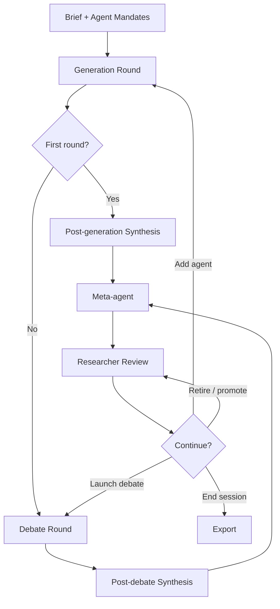
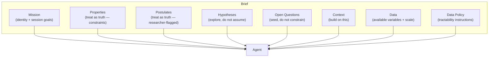
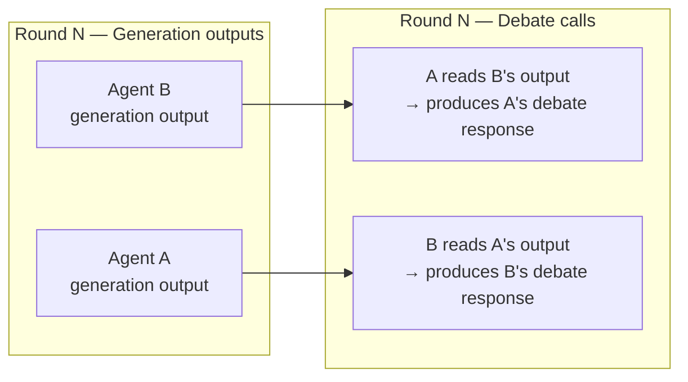
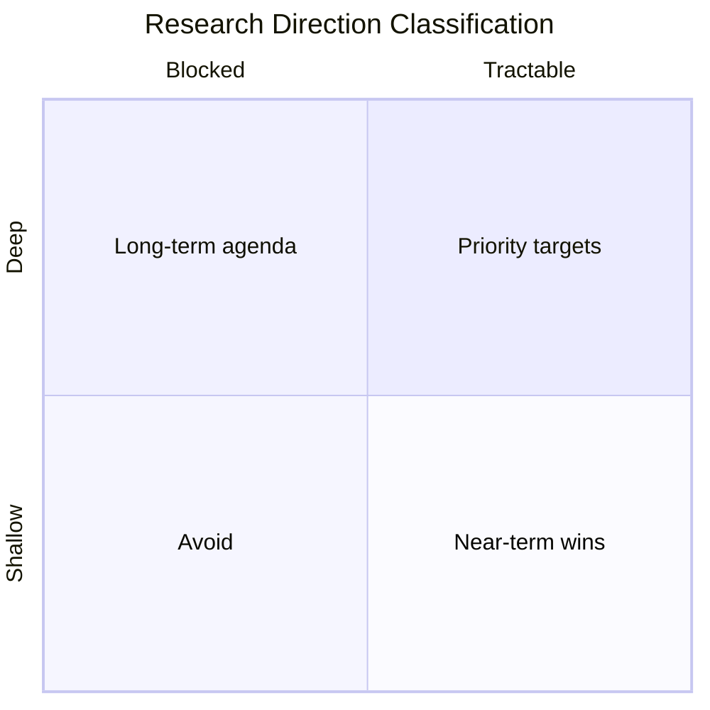
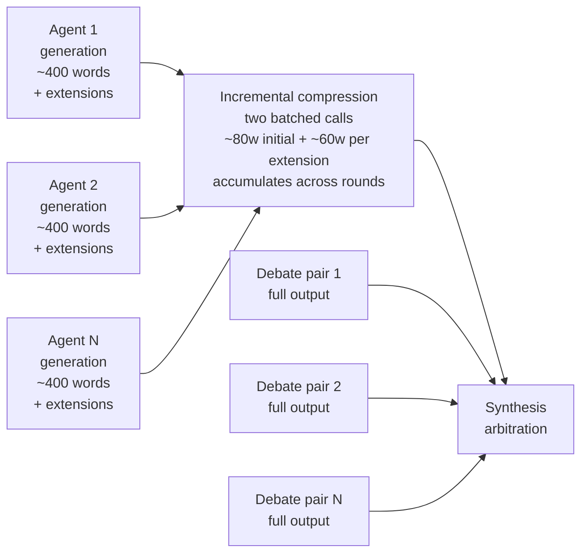
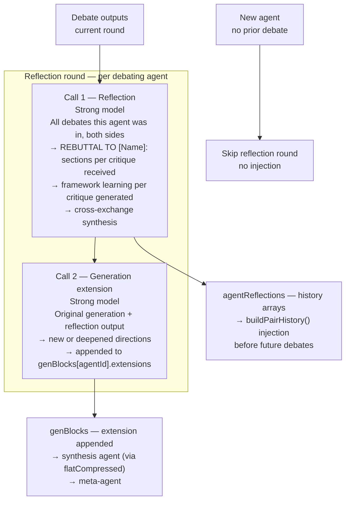

# Research Swarm — Methodology and Design

*A document for understanding what we have built, why we built it this way, and where it is going.*

---

## 1. What problem are we solving?

A researcher working within a single theoretical framework can produce excellent work. Deep expertise in one framework — knowing its tools, its limits, its history of application — is what makes rigorous science possible. The question Research Swarm addresses is different: **how do you systematically identify which other theoretical frameworks are relevant to a problem you are studying, and understand what they would say?**

This is genuinely hard. A researcher with broad mathematical background but finite expertise cannot be deeply fluent in every framework that might illuminate a given system. Identifying the right tool for the job — or recognising that a combination of tools is needed — requires either broad prior knowledge, access to collaborators with complementary expertise, or a way to survey the theoretical landscape efficiently. Productive tensions between incommensurable frameworks often go unnoticed not because researchers are incurious, but because the relevant adjacent discipline was never consulted.

Research Swarm is an attempt to use heterogeneous AI agents to **systematically survey a theoretical landscape**: which frameworks independently converge on the same mechanisms, where frameworks conflict in ways that point to unresolved empirical questions, what each framework cannot see, and which directions are both theoretically deep and immediately tractable. The goal is not a correct answer — it is a structured map of the space.

The tool is also useful as a learning environment: by engaging with outputs from frameworks you are unfamiliar with, and seeing how they engage with frameworks you do know, you can identify which new frameworks are worth learning, and what a collaboration with an outside expert in that framework might produce. This is a secondary aim but a genuine one.

The domain is arbitrary. The methodology is not.

---

## 2. Session lifecycle overview

A session proceeds in repeating cycles. Each cycle consists of four stages:



The researcher intervenes between every major stage. The system is **not autonomous** — it is a structured environment for researcher-guided exploration. This is a deliberate design decision discussed in section 6.

---

## 3. The brief and agent mandates

### 3.1 The brief

The brief is the single most important lever in the system. It is the shared epistemic ground sent identically to every agent on every call throughout the session. Its content directly determines what the swarm explores.

#### Current structure

The brief currently consists of three editable fields:

| Field | Purpose |
|---|---|
| **Problem context** | Describes the system under study: what it is, how it works, known properties, and a general mandate for agents. |
| **Research context** | What is already known, which frameworks exist, prior results and ideas to build on. May include the researcher's own initial theoretical contributions. |
| **Available data** | What datasets are accessible, what variables are measurable, and what data-access instructions agents should follow. |

This structure was chosen to cover the essentials for a first working system. It is sufficient but not fully principled — the current fields conflate several conceptually distinct kinds of information in ways that limit the researcher's control over how agents treat different claims.

#### The researcher's role in authoring the brief

The brief encodes the researcher's best current understanding of the domain. The intellectual choices — what to include, what level of abstraction to use, which postulates to accept — must come from the researcher. The actual drafting can involve AI assistance (for example, using a separate conversation to synthesise a concise research context from multiple source materials), as long as the researcher directs what is included and why.

This is important: the brief is not a neutral description. It is the researcher's intellectual stake in the session — the frame within which all agent outputs are anchored.

#### Why a shared brief rather than specialised contexts?

All agents operate in the same epistemic world. A Bayesian modeller and an evolutionary dynamicist are both trying to explain the same phenomenon. Giving them specialised contexts would allow them to talk past each other; giving them the same context forces them to compete on the same terrain, making genuine disagreements legible.

#### A known tension: known facts vs. postulates

The Problem Context field currently mixes two epistemically distinct kinds of claims:

- **Known properties**: empirically established facts about the system (e.g. "Only climbers who successfully complete a route can propose a grade")
- **Postulates**: claims the researcher believes to be true but has not verified (e.g. "Personal grade proposals are biased by the known consensus grade")

Both are stated as facts, and agents treat them as such. This is sometimes intentional: accepting a postulate as true allows agents to hypothesise *on top of it*, which can generate interesting theoretical directions the researcher would not have anticipated. The alternative — flagging postulates explicitly — would cause agents to address the postulate's validity rather than its implications, shifting the session toward empirical testing rather than theoretical development.

However, there is also a risk: a false postulate accepted as truth can lead the swarm to collectively develop models with a flawed foundation. The researcher must be aware of which claims are genuinely established and which are working assumptions.

The current design leaves this tension unresolved. A more principled brief structure, described below as a future direction, would give the researcher explicit control over how agents treat different claims.

#### Future direction — a richer brief structure (issue #10)

The current three-field structure is a pragmatic first approximation. A more principled design would distinguish the following sections:

**Mission** — the session's identity and goals. Contains the domain framing ("You are a research specialist contributing to a multi-agent theoretical exploration of X"), the general mandate ("Be specific, technically rigorous, and propose directions that would constitute genuine scientific contributions"), and any session-level orientations ("prioritise tractable directions", "focus on theoretical unification rather than empirical testing"). This is boilerplate in the sense that it wraps all other content, but it is the right place for explicit session goals that currently have no dedicated home.

**Properties** — known facts about the system, treated as constraints. Agents should be instructed to treat these as ground truth: their models should be consistent with Properties. Example: "Only climbers who successfully complete a route can propose a grade."

**Postulates** — beliefs the researcher holds but has not verified, also treated as constraints by agents but flagged for the researcher's benefit. Agents treat Postulates identically to Properties; the separation is for the researcher's own clarity about what the swarm is building on. Example: "Personal grade proposals are biased by the known consensus grade and recent proposals."

**Hypotheses** — propositions the researcher suspects are true and wants the swarm to explore. Unlike Properties and Postulates, agents are explicitly instructed *not* to take Hypotheses as given — instead, they should treat them as propositions that theoretical frameworks might support, refute, or reframe. Agents should note when their framework has implications for a listed hypothesis, but are not required to address every hypothesis. Example: "Interactions between anchoring and selection bias lead to grade inflation."

**Open Questions** — research questions the researcher is interested in, stated without a presumed answer. Same treatment as Hypotheses: agents are not required to address them and should be free to propose entirely different questions. The purpose is to seed the swarm's exploration without constraining it. Example: "Is climbing difficulty a well-defined scalar, or do rank-reversal effects provide evidence of genuine multidimensionality?"

**Context** — frameworks, prior results, and theoretical ideas to build on. May span multiple disciplines and may include the researcher's own prior work or initial theoretical contributions. Not restricted to theoretical content — empirical context is equally valid here.

**Data** — what datasets are accessible, what variables are available, the scale and geographical coverage of the data, and any relevant sampling biases.

**Data Policy** — instructions for how agents should reason about data in their proposals. A default policy might be: "Treat research directions requiring the listed datasets as tractable. Flag any direction requiring data not listed above as requiring new data collection. Purely theoretical directions that do not require the listed data are also welcome." The researcher can edit this policy to shift the session's orientation — for example, restricting to empirically testable directions only, or allowing freely speculative theoretical work.



The key design insight is that **the same information, placed in different sections, gives agents different instructions about how to treat it**. A claim in Properties is a constraint; the same claim in Hypotheses is an invitation to explore. The section structure is a lightweight formal language for the researcher's epistemic intentions.

This richer structure also makes the tension between exploration and grounding explicit and navigable: Properties and Postulates ground the swarm; Hypotheses and Open Questions open it. The researcher controls the balance by deciding where to place each claim.

*This is a future direction, not the current implementation. See issue #10.*

### 3.2 Agent mandates

Each agent has a mandate: a ~120-word statement of its disciplinary identity. The mandate specifies which frameworks, methods, and formal tools the agent brings to the problem. It does not prescribe what conclusions the agent will reach.

Mandates are **stable during the execution of a round** — they are not updated automatically by debate outputs or mid-round. Between rounds, the researcher can deliberately revise a mandate via the roster agent, which can both suggest corrections and apply them directly. The roster agent was specifically designed to identify mandate drift — cases where an agent's actual outputs have diverged from what its mandate describes — and propose corrections. So mandates are stable within a session's execution but are revisable through explicit researcher action.

The rationale for not allowing automatic mid-round updating is discussed in section 7.1.

**What makes a good mandate?**

The design hypothesis is that technically specific mandates — ones that name actual frameworks and methods (Fokker-Planck equations, hierarchical Bayesian models, Price equation) rather than vague disciplinary labels — produce more substantive and distinguishable generation and debate outputs. The rationale is that specificity forces the agent to commit to a particular analytical lens, which makes cross-framework disagreements legible rather than generic. A vague mandate ("applies statistical methods") leaves too much interpretive freedom, producing outputs that could have come from any agent. A mandate that is too narrow ("computes Jaccard similarity") produces outputs that cannot engage with the broader theoretical landscape.

This design hypothesis has not been systematically validated. Ueda et al. (SIGDIAL 2025) provide indirect support — they find that broader agent persona heterogeneity enriches idea diversity — but their study varies the *breadth* of disciplinary coverage, not the *specificity* of individual mandates. Whether technically specific mandates outperform broader ones at the level of individual agent output quality is an open empirical question.

A practically useful property of mandates, whether or not the above hypothesis is fully correct: **honest about scope** — the best mandates include what the framework *cannot* do as well as what it can. This seeds self-awareness in debate, making it easier for agents to acknowledge limits rather than over-claim.

---

## 4. Generation round

### 4.1 What happens

Each active agent receives:
- The full brief (shared, cached)
- Its individual mandate (uncached, unique per agent)
- A depth instruction

The depth instruction shapes the length and analytical character of the output. Word count is implicit in the framing rather than stated explicitly as a number:

| Depth | Approx. output | Instruction character |
|---|---|---|
| Brief | ~180 words | Prioritise tractability; state core method in one sentence per direction |
| Detailed | ~320 words | Identify model, key unknown, data requirement; note one non-obvious implication |
| Exhaustive | ~500 words | Sketch relevant equations or model structure; anticipate strongest objection from a competing framework; propose how the objection could be tested |

The association of structural analytical tasks (sketching equations, anticipating objections) with exhaustive depth is a principled design choice, but it is experimental — these tasks could in principle be requested at any depth. An agent could produce a terse, equation-dense output at brief depth, or a long qualitative output at exhaustive depth. The depth selector is better understood as a dial controlling analytical ambition than as a strict word count. What works best at different roster sizes and session goals has not been systematically evaluated.

The output is the agent's independent theoretical contribution: 2–3 research directions proposed from within its disciplinary perspective, applied to the shared brief.

### 4.2 Independence as a design principle

Generation outputs are produced **completely independently**. Agents do not see each other's outputs during generation. This is the foundation of the system's value.

**Why independence matters:**
If agents saw each other's outputs during generation, the resulting outputs would reflect social influence rather than disciplinary difference. The heterogeneity of the swarm — which is the whole point — would be contaminated by anchoring effects before any structured debate had occurred. The independence of generation outputs is what makes the subsequent debate substantive rather than performative.

This is analogous to the Delphi method's first round, where panel members give independent estimates before seeing others' responses. The difference is that Research Swarm's "second round" is structured argumentation rather than simple aggregation.

### 4.3 Smart generation

After the first round, generation only runs for **newly added agents**. Existing agents' generation outputs are preserved across rounds. This reflects a design decision about where learning happens: agents do not regenerate from scratch each round; instead, the debate round is where new information is processed. The reflection round (section 9) addresses this limitation by appending new directions to existing generation outputs after each debate round.

---

## 5. Debate round

The debate round is the most architecturally distinctive part of the system. Its design involves several interrelated choices that are worth understanding in detail.

### 5.1 What a debate call contains

A debating agent receives:
- The full brief (shared, cached — same as generation)
- Its own mandate (uncached — same as generation)
- A single partner's **complete generation output**
- A debate instruction

The debate instruction is:

> *"You have read the output of [Partner]. Write a focused debate response (~N words): challenge assumptions, identify incompatible predictions, or show how combining both frameworks yields something neither could produce alone. Be direct, technically specific, and honest about where your own framework has limits."*

For batched multi-partner debates (when an agent has multiple partners in the same round), the instruction is adapted to request labelled responses to each partner.

### 5.2 Debate is unidirectional per call

Each debate call is **directed**: agent A reads B's generation output and responds to it. Agent B does not simultaneously read A's output. If both A→B and B→A are scheduled in the same round, they fire as separate calls, each reading only the other's *generation output* — not the other's debate response.



**Why unidirectional rather than conversational?**
A true multi-turn conversation between agents would require sequential execution (B cannot respond to A's debate response until A has produced it), would extend session time substantially, and would create a risk of rhetorical convergence — agents would respond to each other's *responses* rather than to each other's underlying theoretical positions. By anchoring debate to generation outputs, we ensure agents are always engaging with each other's disciplinary frameworks, not with each other's rhetorical moves.

The cost of this choice is that debate responses cannot build on each other within a round. This is a genuine limitation. The reflection round (section 9) addresses this by giving agents memory of what was argued across rounds, even if not within-round iteration.

### 5.3 Debate pair typing

The meta-agent assigns each pair a type. The four types encode qualitatively different productive relationships:

| Type | Meaning | When to use |
|---|---|---|
| **CONTRADICTION** | The two frameworks make incompatible predictions about the same phenomenon | Frameworks disagree — the tension is generative |
| **INTERSECTION** | The two frameworks approach an unexplored overlap from different directions | Neither has addressed the shared territory |
| **DISRUPTION** | One framework challenges assumptions that have gone unquestioned | Prevents premature consensus |
| **BRIDGE** | One framework is tractable, one is deep — connecting them could unlock progress | Links what is doable to what is important |

These four types emerged from collaborative AI-assisted design during development rather than from a specific prior literature. There is a relevant tradition in argumentation theory (Walton's dialogue types, Toulmin's argument structure) and in IBIS (Issue-Based Information System, which uses ISSUE, POSITION, ARGUMENT moves), and Perspectra uses ISSUE, CLAIM, SUPPORT, REBUT, QUESTION. The Research Swarm taxonomy is different from all of these — it is oriented toward *research landscape structure* rather than argument validity or forum threading. Whether these four types are the right ones, and whether they are exhaustive, has not been evaluated.

**Why typed pairings?**
The type shapes how the debating agent should orient its response. A CONTRADICTION pairing asks the agent to identify and sharpen incompatible predictions — the right move is to be specific about where the disagreement lies and what data would resolve it. A BRIDGE pairing asks the agent to find connections — the right move is to show how the tractable framework's results could inform the deep one. Without typing, agents would have to infer the productive stance from context, which is less reliable.

The types also give the researcher legible information about the structure of the theoretical landscape: if most pairings are CONTRADICTION, the field has unresolved disagreements; if most are INTERSECTION, the landscape is largely unexplored common ground.

### 5.4 The critical/collaborative balance

The debate instruction deliberately pulls in three directions simultaneously:

- **Critical**: *"challenge assumptions, identify incompatible predictions"*
- **Constructive**: *"show how combining both frameworks yields something neither could produce alone"*
- **Self-limiting**: *"honest about where your own framework has limits"*

This three-way balance — and the specific phrasing — emerged from collaborative AI-assisted design during development. It has not been derived from a specific prior literature on debate prompt design, and has not been systematically evaluated against alternatives.

The intuition behind the balance: a purely adversarial instruction produces rhetorical one-upmanship and no synthesis. A purely collaborative instruction produces agreement without intellectual progress. The "honest about limits" clause is the most important mechanism — an agent instructed to also acknowledge its own framework's limitations is forced into a more epistemically honest posture, one where engagement with another framework can genuinely reveal something rather than merely be deflected.

**Is the current balance right?**
This is an open question. Two failure modes are possible:

1. **Too agreeable**: agents say "interesting, and from my framework I would add..." without genuinely engaging the tension. The synthesis then looks convergent even where real disagreements exist.
2. **Too adversarial**: agents refuse to acknowledge any common ground. The synthesis captures tensions but not tractable paths forward.

The current prompt likely leans toward (1) rather than (2), because LLMs have a strong prior toward agreement. The "challenge assumptions" instruction pushes back against this, but a systematic comparison of debate prompt variants against session quality metrics would be valuable (see issue #3 — evaluation framework).

### 5.5 What debate does not do

Debate responses are produced once and stored. They are not:
- Shown back to the debated-against agent
- Used to update any agent's generation outputs
- Incorporated into any agent's mandate

Agents learn nothing from being debated in isolation. Their base generation outputs remain unchanged across rounds, though the reflection round (section 9) appends new directions after each debate round, making the effective generation output grow as the session progresses.

---

## 6. Synthesis

### 6.1 What the synthesis agent does

After each round (generation or debate), a synthesis arbitration agent reads all relevant outputs and produces a structured summary. The synthesis prompt specifies exact sections with word limits:

```
RESEARCH DIRECTIONS (titles only, tagged by depth × tractability)
CONVERGENCES (60 words max)
TENSIONS (80 words max)
MOST TRACTABLE FIRST STEP (50 words max)
BLIND SPOTS (40 words max)
CONTRADICTIONS (structured format: agent1 vs agent2, claims A and B, resolution method)
```

RESEARCH DIRECTIONS appears first. This is a safety measure: if the synthesis output is ever truncated due to token limits, losing part of CONTRADICTIONS is less damaging than losing the direction classifications, which feed the research map and attribution pipeline. Like the debate pair types and the depth/tractability classification, this section structure and the specific word limits emerged from collaborative AI-assisted design. The rationale for each choice is described below, but none of these have been validated against alternative synthesis formats.

**Why word limits?**
Synthesis agents without word limits produce padded, meandering outputs that dilute the signal. The limits force prioritisation. A synthesis that says "Bayesian and stochastic modellers agree on X" in one sentence is more useful than three paragraphs hedging the same point. Word limits also reduce cost.

**Why structured sections rather than free-form?**
The sections encode what matters most about a theoretical landscape:
- **Research directions**: classified by the depth/tractability matrix (see below); appear first for robustness to truncation
- **Convergences**: what is robustly agreed — safe to build on
- **Tensions**: where the real intellectual action is — productive disagreement
- **Tractable first step**: grounds the abstract in something actionable
- **Blind spots**: what is missing — often the most generative finding
- **Contradictions**: explicitly structured for downstream tracking and resolution

The depth/tractability classification of research directions — also an AI-assisted design choice — is particularly useful as a practical prioritisation tool:



DEEP+TRACTABLE directions are the priority: theoretically important and actionable now. DEEP+BLOCKED directions are worth tracking but cannot be pursued immediately. SHALLOW+TRACTABLE directions are near-term wins. SHALLOW+BLOCKED directions should generally be abandoned.

### 6.2 Direction attribution

Each research direction in the research map carries structured attribution data: which agents contributed substantively to the direction, and which debate exchanges brought it into focus. Attribution is stored as `{id, round}[]` — agent ID paired with the round in which that agent was attributed — rather than a flat list of agent IDs. This round-level granularity is what allows the handover to cap each agent's generation context at the round they were actually working on this direction (see section 10.4).

Attribution is determined by a dedicated cheap-model call that runs immediately after synthesis parses each round's directions, before the meta-agent fires. The call processes both newly added directions and directions the synthesis model explicitly reused by exact title — so that later rounds can extend the attribution record of a direction first identified in an earlier round. The attribution call receives the direction titles (enumerated by code-generated index), the complete set of valid agent IDs and debate pair keys for the current round, and a prompt asking the model to classify which agents and debates contributed substantively to each direction. The model selects from a closed, explicitly enumerated set supplied by the code — it does not invent identifiers. Invalid or unrecognised identifiers are discarded at parse time. New attributions are merged into existing entries rather than replacing them using a union operation that deduplicates on `id+round` composite key.

Running attribution as a separate cheap-model call rather than embedding it in the synthesis output preserves the synthesis format, avoids adding cognitive load to the synthesis model, and isolates a failure in attribution from the synthesis output itself.

Attribution data has two downstream consumers: the **handover feature** (section 12.1), which uses it to pre-load targeted context for the selected direction; and the **meta-agent**, which can use it when proposing future pairings. Attribution is treated as a minimum guarantee rather than an exhaustive classification — the handover agent is not restricted to attributed sources, but attribution determines what is pre-loaded as certainly relevant.

### 6.3 Two-stage synthesis for post-debate rounds

After a debate round, the synthesis agent receives both generation outputs and debate outputs. Generation outputs can be long (~320–500 words each at detailed/exhaustive depth), and grow further as reflection-extended directions accumulate across rounds. Passing all of them directly to synthesis would make the synthesis prompt unwieldy and expensive.

The solution is an incremental compression pipeline:
1. **Compression**: a cheap model maintains a per-agent compressed summary, updated each round by compressing only the new content since the last run — approximately 80 words for an agent's initial generation block, and approximately 60 words per reflection-extended directions block appended in subsequent rounds. The compression model always sees a bounded input; the accumulated summary grows linearly across rounds.
2. **Synthesis**: receives the accumulated compressed summaries + full debate outputs.

Two separate batched compression calls run per synthesis:
- **Batch 1 — initial-block compression**: agents with no cached summary yet (all agents on the first post-debate synthesis; newly joined agents thereafter).
- **Batch 2 — extension-block compression**: agents whose generation record has a new extension block since the last compression. By invariant, always exactly one new block per qualifying agent per round.



**Design decision — why compress generation but not debate?**
The primary motivation is cost: generation outputs can be long (~320–500 words each at detailed/exhaustive depth), and compressing them before synthesis substantially reduces the synthesis prompt size and therefore the API cost. The rationale for compressing generation but *not* debate is that debate outputs contain the specific claims, exact incompatibilities, and precise framework divergences that the synthesis agent needs in full — compressing them risks losing exactly the information that makes debate valuable. Generation outputs, by contrast, carry a signal (which frameworks are being proposed and why) that is more robust to summarisation.

**Why incremental rather than full recompression each round?**
With the reflection round enabled, each agent's generation record grows each round as extension blocks accumulate. Recompressing the full record each round against a fixed word budget causes earlier directions to be dropped in favour of recent content — with no visible signal at synthesis. Incremental compression avoids this: the initial summary is computed once and stored; each new extension block is compressed separately and appended. Earlier content is never competing against later content for the same word budget. Chronological order is preserved naturally, and the total summary length grows predictably.

This is a pragmatic choice, not a validated one. Whether the quality of synthesis outputs degrades meaningfully due to generation compression is unknown. Issue #2 (compression toggle) proposes a user-facing control to disable compression and compare synthesis quality directly.

---

## 7. Key design decisions and their rationale

### 7.1 Mandate stability and the homogenisation risk

Agent mandates are not updated automatically by debate outputs. An agent that is persuaded by a partner's argument during debate does not update its mandate as a result. Between rounds, mandates can be revised through deliberate researcher action via the roster agent — but this is an explicit choice, not an automatic response to debate.

**Why not automatic updating?**
The value of the swarm comes from **maintained heterogeneity**. If mandates updated automatically in response to debate, agents would drift toward consensus over multiple rounds. After several rounds, a Bayesian modeller who repeatedly debates an evolutionary dynamicist might begin proposing evolutionary directions, losing the precise disciplinary difference that made the pairing productive in the first place. The swarm would homogenise.

Stable mandates are the system's primary protection against this failure mode. The reflection round (section 9) gives agents *contextual awareness* of what they have learned through debate — updating their working memory without touching their disciplinary identity.

**What is lost?**
A real researcher does update their methodological commitments based on encounters with other frameworks. Stable mandates prevent agents from modelling this. It is a simplification that trades some realism for guaranteed diversity. Whether this trade-off is correct empirically is unknown — it would require a controlled comparison.

### 7.2 Researcher-steered pairings

The meta-agent proposes debate pairings, but the researcher reviews and can modify them before launching a debate round. The researcher can also toggle individual pairs on or off, adjust agent statuses, and add new agents at any point.

**Why not fully automated?**
Full automation would allow the system to run without human oversight, but would also allow it to drift. The researcher brings domain knowledge the system does not have: they know which proposed pairings reflect genuine theoretical tensions vs. superficial label overlap, which agents are producing redundant outputs, when a direction is not actually tractable given the available data, and when a new perspective is needed that the current roster cannot supply.

The researcher-steered architecture treats the human as an intelligent filter on the meta-agent's proposals, not as a passive consumer of the system's outputs.

**What is lost?**
Researcher steering introduces subjective bias in both directions. A researcher might consistently favour familiar frameworks — but equally might over-appreciate an unfamiliar one whose outputs they cannot critically evaluate. The deeper risk is not directional bias but a lack of the domain expertise needed to judge output quality: if an agent is producing technically incoherent outputs from an unfamiliar framework, the researcher may not recognise this.

One practical recommendation follows from this: it is advisable to include agents for which you have at least some domain familiarity, even if basic. That said, agents from completely unfamiliar frameworks may offer the richest learning opportunity and the highest potential for generating directions that are genuinely novel to the field of study. The researcher must decide how to balance these competing considerations based on their goals for a given session.

The assumption that researcher judgement is more reliable than automated selection is reasonable at the current stage of system development, but should be revisited as the meta-agent improves.

### 7.3 Agent retirement and promotion

Agents can be retired (removed from all future rounds), designated generation-only (contributing to generation but excluded from debate), or promoted (a status flag indicating particularly productive agents). These are researcher decisions, informed but not compelled by the meta-agent's recommendations. Like the debate pair types, the specific status taxonomy emerged from collaborative AI-assisted design and has not been validated against alternatives.

**Why retirement rather than indefinite inclusion?**
As a session progresses, some agents become less productive. An agent whose framework has been exhaustively explored — all its key claims expressed, engaged, and incorporated into synthesis — continues to consume compute without contributing new information. Retirement keeps the active roster focused on agents that are still generating signal.

**Why generation-only status?**
Some agents produce valuable generation outputs but are not productive debate partners — either because their framework is too distant from others to produce useful direct confrontation, or because their outputs are better used as background context than as debate targets. Generation-only status allows the researcher to preserve their contribution to synthesis without forcing unproductive debate pairings.

### 7.4 Typed debate vs. free-form pairings

The rationale for typed pairings is covered in section 5.3. The design decision noted here is the choice to type at the *pairing level* rather than at the *response level*: the meta-agent assigns a type to the pair, and this type is passed to the debating agent as an instruction. An alternative would be to type the *expected response* (e.g. "respond by identifying incompatible predictions") without naming the pairing relationship. The current approach was chosen because it gives the researcher legible landscape-level information — seeing the distribution of CONTRADICTION vs. BRIDGE pairings across the roster tells the researcher something about the theoretical territory — in addition to shaping agent behaviour.

### 7.5 Batched multi-partner debate

An agent can debate multiple partners in a single call. If the meta-agent proposes A→B and A→C, both can be handled in a single API call to agent A, which produces labelled responses to each partner.

**Why batch rather than separate calls?**
The primary motivation is cost: an agent call includes the full shared brief as a cached block. Batching multiple partner responses into one call means paying for the brief once rather than N times. For an agent with 3 partners, batching reduces the cost of those calls by approximately two-thirds.

**What is lost?**
A batched response may be shallower than three separate dedicated responses. The agent divides its token budget across multiple partners, so each individual response receives less attention. Whether this trade-off is worth it depends on whether depth per partner or breadth of engagement is more valuable. The current design favours breadth.

---

## 8. Related work and comparisons

Research Swarm sits at the intersection of several active research areas. Rather than a comprehensive survey, this section identifies the most directly comparable systems and what the comparisons reveal about design choices.

### 8.1 Multi-agent debate for reasoning (Du et al. 2023 and successors)

The foundational multi-agent debate literature (Du et al., 2023) uses multiple instances of the same model debating iteratively to improve factual accuracy and reasoning. Agents read each other's responses and revise over multiple turns. Research Swarm differs fundamentally: agents are heterogeneous specialists (not instances of the same model with the same prompt), debate is typed and directed rather than iterative revision, and the goal is landscape mapping rather than answer convergence. The debate literature targets *correctness*; Research Swarm targets *coverage*.

### 8.2 Multi-agent dialogue design for research ideation (Ueda et al., SIGDIAL 2025)

The most empirically relevant comparable work. Ueda et al. systematically vary agent count, persona heterogeneity, and dialogue depth across 7,000 generated ideas, finding that broader agent persona heterogeneity enriches idea diversity and that increasing critic-side diversity boosts the feasibility of final proposals. Key findings relevant to Research Swarm's design choices:

- **Broader persona heterogeneity improves idea diversity**: supports the design decision to use specialist agents with distinct disciplinary mandates rather than generalist agents
- **More critics improves diversity but can reduce quality**: suggests a tension between roster size and output depth that Research Swarm has not yet investigated systematically
- **Multi-turn refinement improves quality**: supports the value of the reflection round (section 9), which adds a form of within-agent refinement

Their system differs from Research Swarm in that it uses an ideation-critique-revision loop (one agent generates, others critique, the generator revises) rather than parallel generation followed by directed debate. Research Swarm's parallel generation preserves independence; their sequential loop allows direct influence.

### 8.3 Perspectra (Liu et al., CHI 2026)

The closest comparable system for *human-in-the-loop* research ideation. Both use LLM agents assigned expert personas to support interdisciplinary research ideation with researcher control over agent selection. The differences are instructive:

| Dimension | Perspectra | Research Swarm |
|---|---|---|
| **Human involvement** | Per-message (@-mention agents into threads, respond inline) | Per-round (review between rounds, not within) |
| **Debate structure** | Open-ended forum threading; ISSUE, CLAIM, SUPPORT, REBUT, QUESTION | Typed directed pairings; CONTRADICTION, INTERSECTION, DISRUPTION, BRIDGE |
| **Target** | Refine an idea the researcher already has | Map a space the researcher is trying to understand |
| **Agent memory** | Thread-persistent within session | Static generation output as anchor |
| **Synthesis** | Human sensemaking via mind map | Automated arbitration agent |
| **Scale** | Small number in reactive discussions | Larger roster in parallel calls |
| **Output** | Revised research proposal | Structured map: convergences, tensions, blind spots, classified directions |

The most fundamental difference is **granularity of researcher intervention**: Perspectra is better for developing a specific idea; Research Swarm is better for surveying a landscape. Perspectra's finding that structured adversarial discourse significantly increases critical thinking compared to a group-chat baseline provides indirect empirical support for Research Swarm's typed, structured debate approach.

### 8.4 On the provenance of Research Swarm's design choices

Several of the core structural choices in Research Swarm — the four debate pair types, the synthesis section structure, the depth/tractability research direction classification, the agent status taxonomy, the critical/collaborative balance of the debate instruction — emerged from collaborative AI-assisted design during development rather than from a specific prior literature. They are motivated by internal consistency and practical intuition, not by empirical validation or derivation from established frameworks.

This is worth stating explicitly, because the choices *look* principled — and the reasoning behind them is sound — but they have not been evaluated against alternatives. The evaluation framework (issue #3) is the right long-term response to this. Until then, these choices should be treated as well-reasoned hypotheses, not established best practices.

---

## 9. The reflection round

*Implemented in v4.6.0. See issue #5 (closed).*

### 9.1 The problem being solved

In the current system, agents produce generation outputs once and carry them unchanged through all subsequent rounds. The meta-agent reasons about potentially stale directions. Agents that have been debated extensively never incorporate what they learned from debate into their subsequent outputs, and an agent that receives a critique has no mechanism to respond to it before the next time that pair debates.

This is a significant limitation. After a productive debate between the Bayesian and evolutionary frameworks, the Bayesian agent might discover that its hierarchical model structure maps naturally onto the Price equation. This insight is captured in the debate output and reaches the synthesis agent — but it never reaches the Bayesian agent's own subsequent generation output. The next round's generation produces the same directions as the first. Meanwhile, if the evolutionary agent has a substantive rebuttal to the Bayesian critique, there is currently no way for it to communicate that rebuttal before the pair debates again — the Bayesian agent may re-raise the same points that have already been answered.

### 9.2 What both sides of a debate can learn

Debate in the current system is unidirectional per call (Agent 1 critiques Agent 2's generation output), but both agents can potentially learn from the exchange:

**Agent 1 (the critiquing agent)**
- *Anti-repetition memory*: remembers what it previously argued to Agent 2 so it can build on it rather than repeating the same critique next time
- *Framework learning*: generating a critique of Agent 2's framework sometimes reveals something about Agent 1's own — a limitation, a connection, or a direction that Agent 1's framework can now pursue having understood what Agent 2's offers

**Agent 2 (the critiqued agent)**
- *Rebuttal*: may have a substantive response to Agent 1's critique that should be communicated before they debate again — preventing Agent 1 from re-raising points already answered
- *Unlocked directions*: Agent 1's critique may identify something Agent 2's framework cannot address, or may point toward a tractable path Agent 2 had not seen — this can unlock new generation content

In addition, since agents can be involved on either side of multiple debate pairings in a single round, all debate information relevant to a single agent should be **collated and processed together** in a single reflection call. This allows the agent to synthesise insights from multiple exchanges simultaneously, which is where the richest interdisciplinary directions are likely to emerge. Processing each debate sequentially would miss connections across debates.

### 9.3 The proposed design — two calls per agent

The reflection round consists of two sequential calls per agent, both using the **strong model** (Sonnet / Gemini Flash). Both calls run after the debate round and before the next synthesis. Agents that have not participated in any debate (including newly added agents) skip the reflection round entirely.

**Call 1 — Reflection**

The agent receives all debates it was involved in (on either side), collated. The prompt asks for:

1. For each critique *received*: what does it teach the agent? Is there a substantive rebuttal?
2. For each critique *generated*: did studying the partner's framework reveal anything that advances the agent's own directions?
3. Across all exchanges: are there new or deepened directions unlocked by the combination of insights from this round's debates?

The output is **structured** — the agent produces labelled sections (rebuttals per partner, framework learning, unlocked directions) rather than free prose. This structure is what allows the downstream injection to be targeted rather than broadcasting everything to everyone.

The reflection output is stored in a structured per-agent state object:

```js
S.agentReflections[agentId] = {
  history: {
    partnerId: [
      { round: N, critique: "full debate text", rebuttal: null },  // critic's record
      { round: N, critique: null, rebuttal: "rebuttal text" },     // critiqued agent's record
      // one entry appended per debate round, chronological order
    ]
  },
  learning: "cross-exchange synthesis from Call 1"
}
```

Critiques are stored on the critic's own record (keyed by the critiqued agent's id); rebuttals are stored on the critiqued agent's own record (keyed by the critic's id). `buildPairHistory()` merges both sides at read time by matching round numbers. The arrays accumulate across all rounds and are never reset between rounds.

The prompt asks for structured output using delimited `REBUTTAL TO [Name]:` sections — one per critique received — so extraction is reliable rather than dependent on free-form parsing. Rebuttals are only prompted for critiques the agent received; not for critiques it generated.

**Call 2 — Generation extension**

The agent receives its original generation output plus the full reflection output from Call 1 (rebuttals received, what critiques generated taught the agent, unlocked directions). The prompt asks it to generate new or deepened research directions based on what it learned — directions that either were blocked before and are now unlocked, or that go deeper than the original generation given the new understanding. The output is **appended to `S.genBlocks[agentId].extensions`** as a new structured entry with the current round number, making it immediately available to the synthesis agent and the meta-agent for the current round.

The `learning` field from Call 1 is the richest input for generation extension — it captures what the agent now understands about its own framework's limits and opportunities. Its value is expressed through the appended generation output rather than carried forward directly into future debate calls.

The disciplinary constraint is intentionally permissive: *"remain largely within your disciplinary framework, or at least draw heavily on your disciplinary framework if the direction is genuinely interdisciplinary."*



### 9.4 Targeted injection before future debate calls

The only reflection-derived injections before future debate calls are the prior critique texts and rebuttals for the specific pair being debated. Everything else agents receive on a debate call is the standard package: the brief (system prompt, cached), their mandate (system prompt, uncached), and the partner's generation output as the debate content.

**Before Agent 1 debates Agent 2 (Agent 1 is critiquing):**

`buildPairHistory(agent1Id, agent2Id, agent2Name)` is called. It reads Agent 1's history entries for Agent 2 (where `critique` is non-null) and Agent 2's history entries for Agent 1 (where `rebuttal` is non-null), merges them by round number, sorts chronologically, and renders the full exchange history:

```text
Prior exchange history with [Agent 2] (chronological):

[Round N — your critique]
[full prior critique text]
[Round N — Agent 2's rebuttal]
[rebuttal text]

[Round M — your critique]
[full prior critique text]
...
```

This means all prior rounds of exchange between the pair are visible in chronological order, not just the most recent. This prevents Agent 1 from re-raising points already argued and allows it to build on what the exchange has actually established.

**Before Agent 3 debates Agent 2 (a new pairing):**
`buildPairHistory` returns an empty string — no history exists for this pair. Agent 3 should critique Agent 2's current generation output (which already includes appended directions from reflection) without being anchored to issues Agent 1 already raised.

**Call 2 (generation extension):**
Receives the full reflection output from Call 1 including the `learning` field. This is the correct place for `learning` to have effect — it seeds new generation directions rather than shaping debating behaviour.

**Meta-agent:**
Receives a brief summary of which agents have pending rebuttals and what new directions were appended via generation extension. The rebuttal context must be framed carefully in the meta-agent prompt: it is supplementary context available *if a pair is selected for other reasons*, not a primary driver of pairing decisions. The meta-agent prompt should make clear that repeating a pairing should be driven by whether new theoretical territory remains to explore. A pairing that has exhausted productive territory should be retired regardless of whether a rebuttal exists. Treating rebuttals as the primary pairing signal risks locking the session into the same pairs indefinitely.

**Roster agent:**
Does not receive reflection outputs. Already sees updated generation outputs.

### 9.5 Key design constraints

**Mandate stability is preserved.** Reflections are additive working memory only. The mandate remains the agent's stable disciplinary identity.

**Injected as messages, not system prompts.** The system prompt (brief + mandate) must remain stable to preserve the prompt cache. Reflection content varies by agent and by round — it must be injected as messages in the conversation array, not in the system prompt. This is also semantically correct: a system prompt sets what an agent *is*; an injected message records what an agent *experienced*.

**Reflections accumulate.** Information generated during reflection — rebuttals, prior critiques, framework learning, extended generation outputs — accumulates across rounds rather than resetting. Genuine interdisciplinary convergence is not treated as a failure mode; it may be a genuine research finding. The homogenisation risk is managed through prompt design (the disciplinary grounding constraint) and through the UI toggle (section 9.6), not by discarding accumulated context.

**Two-call modularity.** Reflection (Call 1) and generation extension (Call 2) are separate calls. This allows independent model routing in future, cleaner separation of concerns, and makes it easier to ablate one without the other during evaluation.

**Cache compatibility.** Both calls use `agentSystemBlocks(mandate)` (brief + mandate as system prompt, with `cache_control` on Anthropic path) and inject reflection context as messages. No changes to the caching architecture are needed.

### 9.6 UI toggle

A **Reflection round** toggle in the sidebar enables or disables the full two-call pipeline after each debate round. When disabled, the tool behaves exactly as in v4.5.1. When enabled, Call 1 and Call 2 run for all debating agents after each debate round and before synthesis. The toggle state is included in the JSON export so that sessions with and without reflections enabled are distinguishable on import.

### 9.7 Evaluation — a multi-objective problem

Evaluating the reflection round requires measuring two competing objectives simultaneously:

**Progress** — do subsequent outputs go further than they would have without reflection? The most natural comparison surface is the appended generation content and the synthesis text across rounds — do new directions appear, do directions deepen, do new debate pairings emerge? The generation extension output (Call 2) is the primary measurable artefact of progress.

**Homogenisation** — do agents become more similar to each other as a result of reflection? Pairwise semantic similarity between agents' generation outputs (including appended content) across rounds is the right metric. Note that the reflection texts themselves would trivially show *high* between-agent similarity — agents that debated each other will reference each other's frameworks — so generation output similarity is the correct measure, not reflection text similarity.

The two objectives are in tension but not mutually exclusive. Genuine interdisciplinary progress will cause some convergence; the question is whether the convergence is productive (shared understanding of a real connection) or degenerative (loss of disciplinary distinctiveness). This distinction is hard to measure automatically and may ultimately require researcher judgement — which is consistent with the tool's overall design philosophy.

The reflection round design is motivated by analogy with human learning in collaborative contexts, but has no specific empirical citation for multi-agent research ideation. It should be treated as a well-reasoned hypothesis pending evaluation against the v4.5.1 baseline.

---

## 10. The accumulation layer

Across all rounds, the system maintains three accumulating data structures:

**Research map**: all research directions identified by the synthesis agent across all rounds, tagged by depth and tractability, with attribution data and lineage records. Provides a growing, attributed, hierarchically structured map of the theoretical agenda space.

**Contradiction tracker**: all explicitly structured contradictions identified by the synthesis agent. Each entry records the two agents, their incompatible claims, and the proposed resolution method. Provides a record of where the theoretical landscape has genuine fault lines.

**Overlap matrix**: pairwise estimates of productive debate potential between agents, based on mandate text similarity (Jaccard on words >5 characters). Updated by the roster agent. Provides a rough guide to which pairings are likely to be productive.

These structures are the session's primary research output — more useful than any individual agent output or debate response.

### 10.1 Research map entry schema

Each entry carries:

| Field | Type | Description |
|---|---|---|
| `id` | `string` | Stable identifier: `R{round}-{position}`, e.g. `R2-3`. Assigned at parse time; never changes. |
| `title` | `string` | Direction title as produced by the synthesis model. |
| `category` | `string` | One of `DEEP+TRACTABLE`, `DEEP+BLOCKED`, `SHALLOW+TRACTABLE`, `SHALLOW+BLOCKED`. |
| `round` | `number` | Synthesis round in which this direction was first identified. |
| `tag` | `string\|null` | Researcher tag: `pursue`, `revisit`, `needs-data`, `blocked`, or null. |
| `agents` | `{id, round}[]` | Which agents contributed substantively and in which round. Accumulates across rounds via union merge on `id+round` key. |
| `debateRefs` | `{key, round}[]` | Which debate exchanges contributed and in which round. Accumulates via union merge on `key+round`. |
| `parentIds` | `string[]` | IDs of directions this one refines or extends, as annotated by the synthesis model. |

The stable `id` field prevents a latent index-drift bug: before stable IDs, the handover and tag buttons on each map card held closures over the array index. A splice or reorder would silently point those closures at the wrong entry. Stable IDs allow all lookups to use `find(r => r.id === id)` regardless of array mutations.

### 10.2 Direction identity over time — the four cases

From the second synthesis call onward, the prompt shows the synthesis model the existing research map as a numbered index list. The model is instructed to handle each direction it proposes according to its relationship to the existing entries. There are four possible outcomes:

| Synthesis output | Map behaviour | What it means |
|---|---|---|
| New title, no `EXTENDS` | New entry, `parentIds=[]` | Genuinely new direction with no recorded lineage |
| Existing title, no `EXTENDS` | No new entry; attribution updated for this round | Unchanged direction — synthesis model reused the exact title string |
| Existing title + `EXTENDS: N` | No new entry; `EXTENDS` annotation ignored | Model attempted to annotate an existing entry — harmless, nothing changes |
| New title + `EXTENDS: N` | New entry, `parentIds=[id of N]` | Refinement of an existing direction — new title, lineage recorded |

The second row is the most important for attribution quality: when the synthesis model reuses an exact title, it is signalling that the direction is still active and being developed this round. The attribution call processes these reused entries alongside new ones, so contributions from later rounds accumulate in the existing entry's `agents` array. A direction first identified in round 1 attributed to agent A may accumulate `[{id:'A', round:1}, {id:'B', round:3}]` if agent B's round-3 outputs contributed substantially.

The third row (existing title with `EXTENDS`) arises when the model attempts to annotate an existing entry. Since no new entry is created, the `EXTENDS` annotation is silently discarded — the existing entry's `parentIds` were set when it was first created and do not need re-annotation.

**Known limitation — the table assumes reliable instruction-following.** The four cases partition cleanly only when the synthesis model follows the title-reuse and `EXTENDS: N` instructions precisely. In practice the synthesis model is doing genuine semantic analysis — it has just processed all generation outputs and debates — and may re-express a direction it considers "substantively unchanged" with a subtly different title based on new framing. In that case the exact-match check fails and the direction falls into row 1 (new entry, `parentIds=[]`) rather than row 2, creating a near-duplicate on the map when a reuse was intended. Similarly, the boundary between row 1 and row 4 depends on the model's judgement about what constitutes a refinement versus a genuinely new direction: a researcher might consider a row-4 entry (new title, `EXTENDS: N`) to be the same direction as its parent, just better expressed. The lineage mechanism is therefore a best-effort record of the synthesis model's stated intentions, not a guarantee of semantic deduplication. For sessions where near-duplicates appear on the map, the researcher should use the researcher-facing tag system to mark them and the handover feature to understand their relationship.

### 10.3 Synthesis-to-map pipeline

The synthesis model receives one of two prompt variants depending on whether the map is empty:

**First synthesis (empty map):** The `RESEARCH DIRECTIONS` block shows only the four valid category labels with their axis definitions (`DEEP` = theoretically fundamental or novel; `SHALLOW` = incremental or applied; `TRACTABLE` = feasible with available data and methods now; `BLOCKED` = requires unavailable data or an unresolved theoretical prerequisite). No `EXTENDS` or title-reuse instructions appear — there is nothing to reference.

**Subsequent syntheses (populated map):** The prompt prepends the existing map as a numbered index list, then adds two rules:
- *Title reuse*: if a direction is substantively unchanged, reuse the exact title string
- *`EXTENDS: N`*: if a direction refines an existing one, annotate the immediately following line with the integer index from the numbered list — not a name, not a round number

The `parseSynthesis` function processes the synthesis output line by line. It snapshots the existing map before any additions begin — this snapshot provides the index reference for validating `EXTENDS: N` annotations. A direction is added to the map only if its cleaned title is not already present; otherwise the existing entry is flagged as reused and passed to the attribution call. `EXTENDS: N` is validated against the snapshot length; out-of-range indices are silently discarded.

Category labels are parsed permissively: the regex matches any uppercase text in `[X+Y]` bracket format and normalises using keyword-contains checks (`includes('DEEP')`, `includes('TRACTABLE')` etc.). This handles tokenisation-level stutters such as `[DEDEEP+TRACTABLE]` that an exact-match regex would silently drop.

### 10.4 Round-capped handover context

The `{id, round}[]` attribution schema enables targeted context scoping in handover documents. For each agent attributed to a direction, `buildHandoverContext` caps the compressed generation output at the highest round in which that agent was attributed:

```javascript
const maxRound = Math.max(
  ...(item.agents||[]).filter(a => a.id === id).map(a => a.round),
  1
);
const text = flatCompressedUpTo(id, maxRound) || flatGen(id);
```

`flatCompressedUpTo` returns the agent's initial generation summary plus all reflection-extension summaries up to `maxRound`. An agent attributed in rounds 1 and 3 contributes their initial output and their round-3 extension to the handover context. Round-2 extensions (produced while working on other directions) are included too, since the ceiling approach is conservative — it risks including some noise but never excludes content that was active when the agent was attributed. A tighter round-set approach (include only rounds 1 and 3, not 2) is a noted future refinement; see `docs/issue-round-specific-generation-filtering.md`.

### 10.5 Lineage display

Only root entries — those with no `parentIds` that resolve to a current map entry — are rendered as full standalone cards in the map panel. Child entries (directions with a resolvable parent) appear exclusively as `↳ Title CATEGORY·Rn` rows beneath their parent's card, with a handover button; they do not generate separate standalone cards. This prevents each direction from appearing twice and keeps the map readable as the lineage graph deepens across rounds.

The child rendering is recursive: each child row is followed by its own children (grandchildren of the parent card), each indented a further 12 px to the right. A depth guard of 8 prevents runaway recursion in the unlikely event of a circular reference. The tag buttons are available only on standalone root cards; tagging of child directions is a noted future enhancement.

The handover context renders the same hierarchy as indented plain text for the handover model, with each level of parent–child nesting represented by two-space indentation. This allows the handover model to cite lineage relationships explicitly rather than inferring them from title similarity.

---

## 11. The roster agent

The roster agent is a separate on-demand LLM call that analyses the current brief, all agent mandates, and the overlap matrix to suggest:
- New agents to add (with proposed mandate)
- Status changes (retire, promote, gen-only, activate)
- Mandate drift corrections (cases where an agent's outputs suggest its mandate is no longer accurately describing its behaviour)

**Why a separate agent rather than folding this into the meta-agent?**
The meta-agent runs after every synthesis and focuses on the immediate next round: which pairings, which status changes, based on what the synthesis just found. The roster agent is a slower, higher-level intervention: is the *composition* of the swarm still right for the research agenda? These are different questions operating at different timescales. Separating them keeps each agent's prompt focused and prevents the meta-agent from being distracted by roster-level concerns when its job is proposing pairings.

---

## 12. What a session produces

A completed session produces:

1. **JSON export**: full session state — all generation outputs, all debate outputs, all synthesis texts, all pairing proposals, all accumulating structures. Machine-readable, importable for continuation.

2. **Markdown export**: human-readable session record.

3. **Research map**: classified directions across all rounds, with attribution data recording which agents and debate exchanges contributed substantively to each direction.

4. **Contradiction tracker**: structured fault lines in the theoretical landscape.

5. **Synthesis history**: all synthesis outputs with timestamps — the evolving understanding of the landscape.

6. **Direction handover documents**: structured research briefs generated on demand for selected directions from the research map. Described in section 12.1.

The intended use of a session is not to extract any single output but to use the **accumulated structure** as the basis for researcher judgement about which directions to pursue, which tensions to investigate empirically, and what kinds of theoretical work the domain most needs. The handover feature is what makes that judgement directly actionable: it bridges the gap between the research map as a classified index and a direction as something a researcher can begin working on.

### 12.1 Direction handover documents

The research map accumulates classified directions across all rounds, but a direction title alone does not constitute a research brief. A title like *Asymptotic grade inflation under selection bias* is meaningful to a researcher who participated in the session, but it does not convey which theoretical frameworks converge to support the direction, which debate exchanges brought it into focus, what obstacles were identified, what data it requires, or where to begin. This context is distributed across the session export and must be assembled before work can start. The handover feature automates that assembly, producing a structured document per selected direction that the researcher can use as working notes or provide directly to an independent AI session for further exploration.

**Attribution at synthesis time.** The central design decision is to record which agents and debate exchanges contributed to each direction *at the moment synthesis runs*, not to reconstruct that attribution later from text. When the synthesis model classifies a new direction, it has just processed the full round context — it has the most reliable possible view of which agents proposed related ideas and which debates brought the direction into focus. Recording this as structured data attached to the research map entry, rather than leaving it implicit in the synthesis text, means the handover can draw on targeted and directly relevant context rather than the full session history. This reflects a broader design principle in the tool: information that is knowable at the time of a structured event should be recorded explicitly as structured data at that time. Reconstruction from text is slower, more fragile, and wastes information that was available at the moment of production.

Attribution is recorded as a minimum guarantee, not an exhaustive classification. The handover agent is not restricted to attributed sources — it can draw on any session content it finds relevant. The attribution data determines what is pre-loaded into the handover context as certainly relevant; it does not limit what the agent can reason about.

**The handover as companion to the session export.** The researcher has the full JSON session export available alongside the handover document. The handover is designed as a navigational and analytical layer on top of that export, not a replacement for it. It references specific content by round number, agent name, and section — pointing the researcher to the relevant parts of the export rather than reproducing them at length. Content is reproduced directly only where a specific equation, formal definition, or short claim would be materially inconvenient to look up. This design keeps the handover focused and prevents it from becoming a verbose paraphrase of material the researcher already has.

**Ordering by research logic, not session chronology.** The session proceeds by rounds, and interesting ideas can appear in any round in any order. The handover document is ordered for research progression — the sequence in which a researcher would actually engage with the material — not for the sequence in which ideas appeared in the session. A theoretical foundation established in round 3 may belong at the beginning of a research narrative; a convergence from round 1 may belong near the end if it represents a conclusion rather than a starting point. This is a synthesis task, not a retrieval task. The handover agent constructs a research narrative in which session content appears where it is most useful, independent of when it was produced.

**Agent-transcending synthesis.** The handover agent synthesises across disciplinary perspectives. It is not bound by any individual agent's mandate or framework — agent specialisations are inputs to the handover, not constraints on it. A research narrative for a direction that emerged from debate between an information theorist and an extreme value statistician need not be written from either perspective; it should be written from whichever perspective produces the most coherent and productive research brief, even if that perspective was not represented by any individual agent in the session. This is a deliberate departure from how the rest of the tool works. Generation and debate preserve disciplinary identity because heterogeneity is the mechanism that generates substantive tension. The handover has a different goal: actionable coherence for a single researcher pursuing a single direction. The swarm's heterogeneity is the *input*; the handover's synthesis is the *output*.

**Mathematical and diagrammatic content.** Technical precision is a first-class output. Where a claim is most precisely expressed as an equation, the equation should appear — prose descriptions of mathematical objects are less useful to a working researcher than the objects themselves. Where a system structure, model architecture, analytical pipeline, or relationship between theoretical frameworks is more clearly represented as a diagram than as text, a Mermaid diagram should appear. The handover is a working research brief that the researcher will use to think with, not a summary intended for a general reader.

**The research programme.** The handover does not only tell the researcher what to do first. It traces the full arc of the work the direction represents, organised into logical phases ordered by dependency: what must be established before the core work can begin, what the core analytical or theoretical contribution is, and how that contribution could be extended or generalised. Each phase is framed around a deliverable — the specific result, dataset, or theoretical artifact whose completion makes the next phase possible. Later phases are explicitly framed as conditional on earlier outcomes. The value is not in producing a fixed plan — research rarely follows one — but in making the dependency structure and the shape of a successful outcome explicit before work begins. Alongside the programme, the handover identifies two or three immediate actions the researcher can take with minimal setup cost and high information return: the first moves that do not require any phase to be complete before they are possible.

---

## 13. What we do not do (and why)

**On our goal.** The goal of Research Swarm is to preserve the heterogeneity of perspectives across the swarm while progressing debate to unlock new research directions — without becoming homogenised or resolving to a single answer. These are two simultaneous objectives in tension. Maintained heterogeneity enables substantive debate; progressive debate is what generates new directions. The system's design is an attempt to hold both: stable mandates protect heterogeneity, the reflection round (section 9) enables progress, and the researcher's intervention at every round boundary is the mechanism for steering between them.

**We do not let agents communicate freely.** Free-form multi-agent discussion is possible (and is what Perspectra does), but produces outputs that are hard to interpret and accumulate. Typed directed pairings produce structured, interpretable debate that feeds cleanly into synthesis.

**We do not aggregate or vote.** Many multi-agent systems aggregate agent outputs (via voting, averaging, or weighted consensus) to produce a single answer. Research Swarm explicitly does not aggregate. The synthesis captures convergences without erasing tensions — the heterogeneity of perspectives is the primary output, not a problem to be resolved.

**We do not evaluate output quality automatically.** We could run an LLM-as-judge to score generation outputs and debate responses. We choose not to, because LLM-as-judge is unreliable for creative theoretical work — it tends to prefer confident, fluent outputs over genuinely novel ones. Researcher judgement, exercised at every round boundary, is the quality filter.

**We do not update mandates automatically.** Mandates are stable during execution and revisable only through deliberate researcher action via the roster agent. The rationale is discussed in section 7.1.

**We do not run multiple sessions and compare.** A single session produces one trajectory through the theoretical landscape. Meaningful comparison would require controlled variation of brief, roster, or pairing strategy across multiple sessions — which is tractable but has not yet been done.
