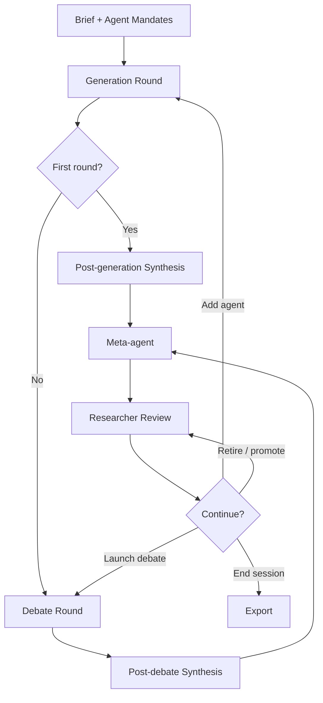
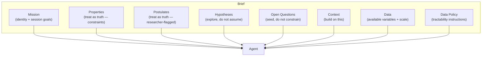
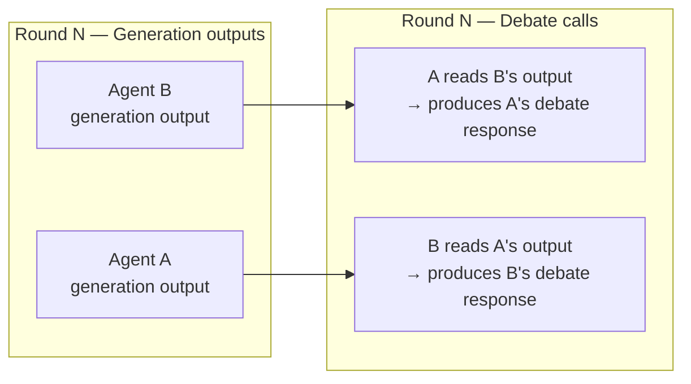
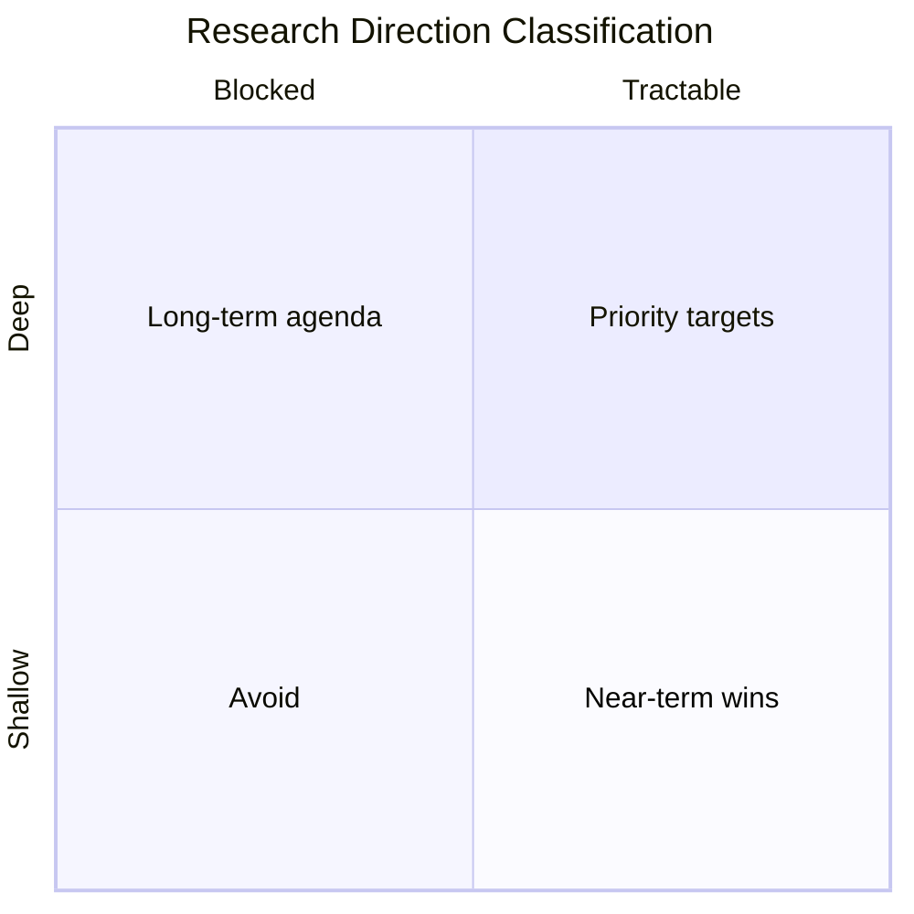
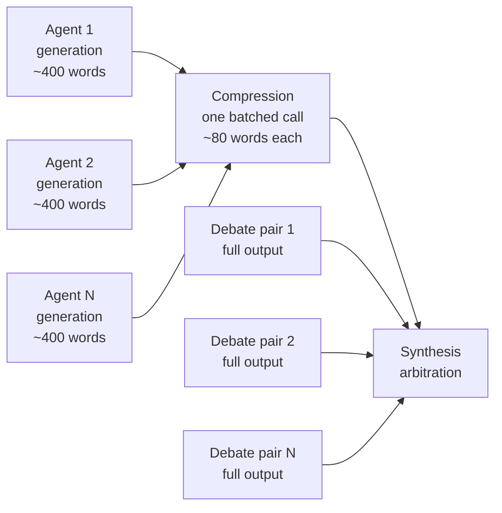
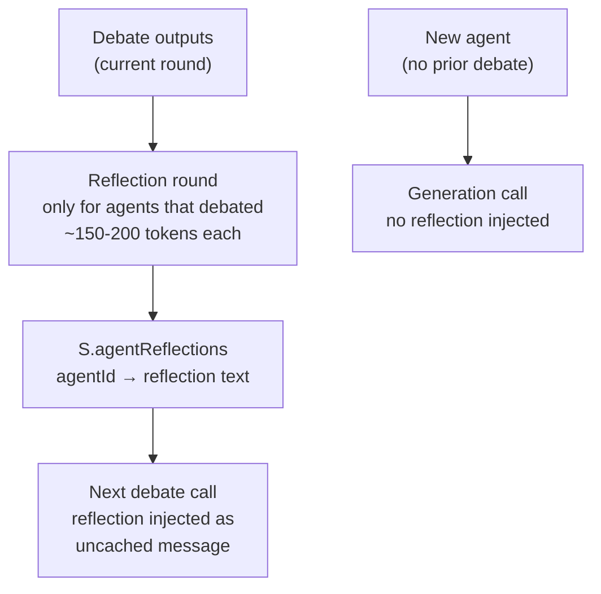

# Research Swarm — Methodology and Design

*A document for understanding what we have built, why we built it this way, and where it is going.*

---

## 1. What problem are we solving?

A researcher working within a single theoretical framework can produce excellent work. Deep expertise in one framework — knowing its tools, its limits, its history of application — is what makes rigorous science possible. The question Research Swarm addresses is different: **how do you systematically identify which other theoretical frameworks are relevant to a problem you are studying, and understand what they would say?**

This is genuinely hard. A researcher with broad mathematical background but finite expertise cannot be deeply fluent in every framework that might illuminate a given system. Identifying the right tool for the job — or recognising that a combination of tools is needed — requires either broad prior knowledge, access to collaborators with complementary expertise, or a way to survey the theoretical landscape efficiently. Productive tensions between incommensurable frameworks often go unnoticed not because researchers are incurious, but because the relevant adjacent discipline was never consulted.

Research Swarm is an attempt to use heterogeneous AI agents to **systematically survey a theoretical landscape**: which frameworks independently converge on the same mechanisms, where frameworks conflict in ways that point to unresolved empirical questions, what each framework cannot see, and which directions are both theoretically deep and immediately tractable. The goal is not a correct answer — it is a structured map of the space.

The tool is also useful as a learning environment: by engaging with outputs from frameworks you are unfamiliar with, and seeing how they engage with frameworks you do know, you can identify which new frameworks are worth learning, and what a collaboration with an outside expert in that framework might produce. This is a secondary aim but a genuine one.

The domain is arbitrary. The methodology is not.

---

## 2. Session lifecycle overview

A session proceeds in repeating cycles. Each cycle consists of four stages:



The researcher intervenes between every major stage. The system is **not autonomous** — it is a structured environment for researcher-guided exploration. This is a deliberate design decision discussed in section 6.

---

## 3. The brief and agent mandates

### 3.1 The brief

The brief is the single most important lever in the system. It is the shared epistemic ground sent identically to every agent on every call throughout the session. Its content directly determines what the swarm explores.

#### Current structure

The brief currently consists of three editable fields:

| Field | Purpose |
|---|---|
| **Problem context** | Describes the system under study: what it is, how it works, known properties, and a general mandate for agents. |
| **Research context** | What is already known, which frameworks exist, prior results and ideas to build on. May include the researcher's own initial theoretical contributions. |
| **Available data** | What datasets are accessible, what variables are measurable, and what data-access instructions agents should follow. |

This structure was chosen to cover the essentials for a first working system. It is sufficient but not fully principled — the current fields conflate several conceptually distinct kinds of information in ways that limit the researcher's control over how agents treat different claims.

#### The researcher's role in authoring the brief

The brief encodes the researcher's best current understanding of the domain. The intellectual choices — what to include, what level of abstraction to use, which postulates to accept — must come from the researcher. The actual drafting can involve AI assistance (for example, using a separate conversation to synthesise a concise research context from multiple source materials), as long as the researcher directs what is included and why.

This is important: the brief is not a neutral description. It is the researcher's intellectual stake in the session — the frame within which all agent outputs are anchored.

#### Why a shared brief rather than specialised contexts?

All agents operate in the same epistemic world. A Bayesian modeller and an evolutionary dynamicist are both trying to explain the same phenomenon. Giving them specialised contexts would allow them to talk past each other; giving them the same context forces them to compete on the same terrain, making genuine disagreements legible.

#### A known tension: known facts vs. postulates

The Problem Context field currently mixes two epistemically distinct kinds of claims:

- **Known properties**: empirically established facts about the system (e.g. "Only climbers who successfully complete a route can propose a grade")
- **Postulates**: claims the researcher believes to be true but has not verified (e.g. "Personal grade proposals are biased by the known consensus grade")

Both are stated as facts, and agents treat them as such. This is sometimes intentional: accepting a postulate as true allows agents to hypothesise *on top of it*, which can generate interesting theoretical directions the researcher would not have anticipated. The alternative — flagging postulates explicitly — would cause agents to address the postulate's validity rather than its implications, shifting the session toward empirical testing rather than theoretical development.

However, there is also a risk: a false postulate accepted as truth can lead the swarm to collectively develop models with a flawed foundation. The researcher must be aware of which claims are genuinely established and which are working assumptions.

The current design leaves this tension unresolved. A more principled brief structure, described below as a future direction, would give the researcher explicit control over how agents treat different claims.

#### Future direction — a richer brief structure (issue #10)

The current three-field structure is a pragmatic first approximation. A more principled design would distinguish the following sections:

**Mission** — the session's identity and goals. Contains the domain framing ("You are a research specialist contributing to a multi-agent theoretical exploration of X"), the general mandate ("Be specific, technically rigorous, and propose directions that would constitute genuine scientific contributions"), and any session-level orientations ("prioritise tractable directions", "focus on theoretical unification rather than empirical testing"). This is boilerplate in the sense that it wraps all other content, but it is the right place for explicit session goals that currently have no dedicated home.

**Properties** — known facts about the system, treated as constraints. Agents should be instructed to treat these as ground truth: their models should be consistent with Properties. Example: "Only climbers who successfully complete a route can propose a grade."

**Postulates** — beliefs the researcher holds but has not verified, also treated as constraints by agents but flagged for the researcher's benefit. Agents treat Postulates identically to Properties; the separation is for the researcher's own clarity about what the swarm is building on. Example: "Personal grade proposals are biased by the known consensus grade and recent proposals."

**Hypotheses** — propositions the researcher suspects are true and wants the swarm to explore. Unlike Properties and Postulates, agents are explicitly instructed *not* to take Hypotheses as given — instead, they should treat them as propositions that theoretical frameworks might support, refute, or reframe. Agents should note when their framework has implications for a listed hypothesis, but are not required to address every hypothesis. Example: "Interactions between anchoring and selection bias lead to grade inflation."

**Open Questions** — research questions the researcher is interested in, stated without a presumed answer. Same treatment as Hypotheses: agents are not required to address them and should be free to propose entirely different questions. The purpose is to seed the swarm's exploration without constraining it. Example: "Is climbing difficulty a well-defined scalar, or do rank-reversal effects provide evidence of genuine multidimensionality?"

**Context** — frameworks, prior results, and theoretical ideas to build on. May span multiple disciplines and may include the researcher's own prior work or initial theoretical contributions. Not restricted to theoretical content — empirical context is equally valid here.

**Data** — what datasets are accessible, what variables are available, the scale and geographical coverage of the data, and any relevant sampling biases.

**Data Policy** — instructions for how agents should reason about data in their proposals. A default policy might be: "Treat research directions requiring the listed datasets as tractable. Flag any direction requiring data not listed above as requiring new data collection. Purely theoretical directions that do not require the listed data are also welcome." The researcher can edit this policy to shift the session's orientation — for example, restricting to empirically testable directions only, or allowing freely speculative theoretical work.



The key design insight is that **the same information, placed in different sections, gives agents different instructions about how to treat it**. A claim in Properties is a constraint; the same claim in Hypotheses is an invitation to explore. The section structure is a lightweight formal language for the researcher's epistemic intentions.

This richer structure also makes the tension between exploration and grounding explicit and navigable: Properties and Postulates ground the swarm; Hypotheses and Open Questions open it. The researcher controls the balance by deciding where to place each claim.

*This is a future direction, not the current implementation. See issue #10.*

### 3.2 Agent mandates

Each agent has a mandate: a ~120-word statement of its disciplinary identity. The mandate specifies which frameworks, methods, and formal tools the agent brings to the problem. It does not prescribe what conclusions the agent will reach.

Mandates are **stable during the execution of a round** — they are not updated automatically by debate outputs or mid-round. Between rounds, the researcher can deliberately revise a mandate via the roster agent, which can both suggest corrections and apply them directly. The roster agent was specifically designed to identify mandate drift — cases where an agent's actual outputs have diverged from what its mandate describes — and propose corrections. So mandates are stable within a session's execution but are revisable through explicit researcher action.

The rationale for not allowing automatic mid-round updating is discussed in section 7.1.

**What makes a good mandate?**

The design hypothesis is that technically specific mandates — ones that name actual frameworks and methods (Fokker-Planck equations, hierarchical Bayesian models, Price equation) rather than vague disciplinary labels — produce more substantive and distinguishable generation and debate outputs. The rationale is that specificity forces the agent to commit to a particular analytical lens, which makes cross-framework disagreements legible rather than generic. A vague mandate ("applies statistical methods") leaves too much interpretive freedom, producing outputs that could have come from any agent. A mandate that is too narrow ("computes Jaccard similarity") produces outputs that cannot engage with the broader theoretical landscape.

This design hypothesis has not been systematically validated. Ueda et al. (SIGDIAL 2025) provide indirect support — they find that broader agent persona heterogeneity enriches idea diversity — but their study varies the *breadth* of disciplinary coverage, not the *specificity* of individual mandates. Whether technically specific mandates outperform broader ones at the level of individual agent output quality is an open empirical question.

A practically useful property of mandates, whether or not the above hypothesis is fully correct: **honest about scope** — the best mandates include what the framework *cannot* do as well as what it can. This seeds self-awareness in debate, making it easier for agents to acknowledge limits rather than over-claim.

---

## 4. Generation round

### 4.1 What happens

Each active agent receives:
- The full brief (shared, cached)
- Its individual mandate (uncached, unique per agent)
- A depth instruction

The depth instruction shapes the length and analytical character of the output. Word count is implicit in the framing rather than stated explicitly as a number:

| Depth | Approx. output | Instruction character |
|---|---|---|
| Brief | ~180 words | Prioritise tractability; state core method in one sentence per direction |
| Detailed | ~320 words | Identify model, key unknown, data requirement; note one non-obvious implication |
| Exhaustive | ~500 words | Sketch relevant equations or model structure; anticipate strongest objection from a competing framework; propose how the objection could be tested |

The association of structural analytical tasks (sketching equations, anticipating objections) with exhaustive depth is a principled design choice, but it is experimental — these tasks could in principle be requested at any depth. An agent could produce a terse, equation-dense output at brief depth, or a long qualitative output at exhaustive depth. The depth selector is better understood as a dial controlling analytical ambition than as a strict word count. What works best at different roster sizes and session goals has not been systematically evaluated.

The output is the agent's independent theoretical contribution: 2–3 research directions proposed from within its disciplinary perspective, applied to the shared brief.

### 4.2 Independence as a design principle

Generation outputs are produced **completely independently**. Agents do not see each other's outputs during generation. This is the foundation of the system's value.

**Why independence matters:**
If agents saw each other's outputs during generation, the resulting outputs would reflect social influence rather than disciplinary difference. The heterogeneity of the swarm — which is the whole point — would be contaminated by anchoring effects before any structured debate had occurred. The independence of generation outputs is what makes the subsequent debate substantive rather than performative.

This is analogous to the Delphi method's first round, where panel members give independent estimates before seeing others' responses. The difference is that Research Swarm's "second round" is structured argumentation rather than simple aggregation.

### 4.3 Smart generation

After the first round, generation only runs for **newly added agents**. Existing agents' generation outputs are preserved across rounds. This reflects a design decision about where learning happens: agents do not regenerate from scratch each round; instead, the debate round is where new information is processed. The reflection round (section 9) will partially address this limitation.

---

## 5. Debate round

The debate round is the most architecturally distinctive part of the system. Its design involves several interrelated choices that are worth understanding in detail.

### 5.1 What a debate call contains

A debating agent receives:
- The full brief (shared, cached — same as generation)
- Its own mandate (uncached — same as generation)
- A single partner's **complete generation output**
- A debate instruction

The debate instruction is:

> *"You have read the output of [Partner]. Write a focused debate response (~N words): challenge assumptions, identify incompatible predictions, or show how combining both frameworks yields something neither could produce alone. Be direct, technically specific, and honest about where your own framework has limits."*

For batched multi-partner debates (when an agent has multiple partners in the same round), the instruction is adapted to request labelled responses to each partner.

### 5.2 Debate is unidirectional per call

Each debate call is **directed**: agent A reads B's generation output and responds to it. Agent B does not simultaneously read A's output. If both A→B and B→A are scheduled in the same round, they fire as separate calls, each reading only the other's *generation output* — not the other's debate response.



**Why unidirectional rather than conversational?**
A true multi-turn conversation between agents would require sequential execution (B cannot respond to A's debate response until A has produced it), would extend session time substantially, and would create a risk of rhetorical convergence — agents would respond to each other's *responses* rather than to each other's underlying theoretical positions. By anchoring debate to generation outputs, we ensure agents are always engaging with each other's disciplinary frameworks, not with each other's rhetorical moves.

The cost of this choice is that debate responses cannot build on each other within a round. This is a genuine limitation. The reflection round (section 9) is partly motivated by the desire to give agents some memory of what was argued, even if not within-round iteration.

### 5.3 Debate pair typing

The meta-agent assigns each pair a type. The four types encode qualitatively different productive relationships:

| Type | Meaning | When to use |
|---|---|---|
| **CONTRADICTION** | The two frameworks make incompatible predictions about the same phenomenon | Frameworks disagree — the tension is generative |
| **INTERSECTION** | The two frameworks approach an unexplored overlap from different directions | Neither has addressed the shared territory |
| **DISRUPTION** | One framework challenges assumptions that have gone unquestioned | Prevents premature consensus |
| **BRIDGE** | One framework is tractable, one is deep — connecting them could unlock progress | Links what is doable to what is important |

These four types emerged from collaborative AI-assisted design during development rather than from a specific prior literature. There is a relevant tradition in argumentation theory (Walton's dialogue types, Toulmin's argument structure) and in IBIS (Issue-Based Information System, which uses ISSUE, POSITION, ARGUMENT moves), and Perspectra uses ISSUE, CLAIM, SUPPORT, REBUT, QUESTION. The Research Swarm taxonomy is different from all of these — it is oriented toward *research landscape structure* rather than argument validity or forum threading. Whether these four types are the right ones, and whether they are exhaustive, has not been evaluated.

**Why typed pairings?**
The type shapes how the debating agent should orient its response. A CONTRADICTION pairing asks the agent to identify and sharpen incompatible predictions — the right move is to be specific about where the disagreement lies and what data would resolve it. A BRIDGE pairing asks the agent to find connections — the right move is to show how the tractable framework's results could inform the deep one. Without typing, agents would have to infer the productive stance from context, which is less reliable.

The types also give the researcher legible information about the structure of the theoretical landscape: if most pairings are CONTRADICTION, the field has unresolved disagreements; if most are INTERSECTION, the landscape is largely unexplored common ground.

### 5.4 The critical/collaborative balance

The debate instruction deliberately pulls in three directions simultaneously:

- **Critical**: *"challenge assumptions, identify incompatible predictions"*
- **Constructive**: *"show how combining both frameworks yields something neither could produce alone"*
- **Self-limiting**: *"honest about where your own framework has limits"*

This three-way balance — and the specific phrasing — emerged from collaborative AI-assisted design during development. It has not been derived from a specific prior literature on debate prompt design, and has not been systematically evaluated against alternatives.

The intuition behind the balance: a purely adversarial instruction produces rhetorical one-upmanship and no synthesis. A purely collaborative instruction produces agreement without intellectual progress. The "honest about limits" clause is the most important mechanism — an agent instructed to also acknowledge its own framework's limitations is forced into a more epistemically honest posture, one where engagement with another framework can genuinely reveal something rather than merely be deflected.

**Is the current balance right?**
This is an open question. Two failure modes are possible:

1. **Too agreeable**: agents say "interesting, and from my framework I would add..." without genuinely engaging the tension. The synthesis then looks convergent even where real disagreements exist.
2. **Too adversarial**: agents refuse to acknowledge any common ground. The synthesis captures tensions but not tractable paths forward.

The current prompt likely leans toward (1) rather than (2), because LLMs have a strong prior toward agreement. The "challenge assumptions" instruction pushes back against this, but a systematic comparison of debate prompt variants against session quality metrics would be valuable (see issue #3 — evaluation framework).

### 5.5 What debate does not do

Debate responses are produced once and stored. They are not:
- Shown back to the debated-against agent
- Used to update any agent's generation outputs
- Incorporated into any agent's mandate

This means agents learn nothing from being debated in the current implementation. Their generation outputs remain unchanged across rounds. The reflection round (section 9) addresses this directly.

---

## 6. Synthesis

### 6.1 What the synthesis agent does

After each round (generation or debate), a synthesis arbitration agent reads all relevant outputs and produces a structured summary. The synthesis prompt specifies exact sections with word limits:

```
CONVERGENCES (60 words max)
TENSIONS (80 words max)
MOST TRACTABLE FIRST STEP (50 words max)
BLIND SPOTS (40 words max)
RESEARCH DIRECTIONS (titles only, tagged by depth × tractability)
CONTRADICTIONS (structured format: agent1 vs agent2, claims A and B, resolution method)
```

Like the debate pair types and the depth/tractability classification, this section structure and the specific word limits emerged from collaborative AI-assisted design. The rationale for each choice is described below, but none of these have been validated against alternative synthesis formats.

**Why word limits?**
Synthesis agents without word limits produce padded, meandering outputs that dilute the signal. The limits force prioritisation. A synthesis that says "Bayesian and stochastic modellers agree on X" in one sentence is more useful than three paragraphs hedging the same point. Word limits also reduce cost.

**Why structured sections rather than free-form?**
The sections encode what matters most about a theoretical landscape:
- **Convergences**: what is robustly agreed — safe to build on
- **Tensions**: where the real intellectual action is — productive disagreement
- **Tractable first step**: grounds the abstract in something actionable
- **Blind spots**: what is missing — often the most generative finding
- **Research directions**: classified by the depth/tractability matrix (see below)
- **Contradictions**: explicitly structured for downstream tracking and resolution

The depth/tractability classification of research directions — also an AI-assisted design choice — is particularly useful as a practical prioritisation tool:



DEEP+TRACTABLE directions are the priority: theoretically important and actionable now. DEEP+BLOCKED directions are worth tracking but cannot be pursued immediately. SHALLOW+TRACTABLE directions are near-term wins. SHALLOW+BLOCKED directions should generally be abandoned.

### 6.2 Two-stage synthesis for post-debate rounds

After a debate round, the synthesis agent receives both generation outputs and debate outputs. Generation outputs can be long (~320–500 words each at detailed/exhaustive depth). Passing all of them directly to synthesis would make the synthesis prompt unwieldy and expensive.

The solution is a two-stage pipeline:
1. **Compression**: a cheap model summarises each agent's generation output to ~80 words, preserving key technical claims
2. **Synthesis**: receives compressed generation summaries + full debate outputs



**Design decision — why compress generation but not debate?**
The primary motivation is cost: generation outputs can be long (~320–500 words each at detailed/exhaustive depth), and compressing them to ~80 words before synthesis substantially reduces the synthesis prompt size and therefore the API cost. The rationale for compressing generation but *not* debate is that debate outputs contain the specific claims, exact incompatibilities, and precise framework divergences that the synthesis agent needs in full — compressing them risks losing exactly the information that makes debate valuable. Generation outputs, by contrast, carry a signal (which frameworks are being proposed and why) that is more robust to summarisation.

This is a pragmatic choice, not a validated one. Whether the quality of synthesis outputs degrades meaningfully due to generation compression is unknown. Issue #2 (compression toggle) proposes a user-facing control to disable compression and compare synthesis quality directly.

---

## 7. Key design decisions and their rationale

### 7.1 Mandate stability and the homogenisation risk

Agent mandates are not updated automatically by debate outputs. An agent that is persuaded by a partner's argument during debate does not update its mandate as a result. Between rounds, mandates can be revised through deliberate researcher action via the roster agent — but this is an explicit choice, not an automatic response to debate.

**Why not automatic updating?**
The value of the swarm comes from **maintained heterogeneity**. If mandates updated automatically in response to debate, agents would drift toward consensus over multiple rounds. After several rounds, a Bayesian modeller who repeatedly debates an evolutionary dynamicist might begin proposing evolutionary directions, losing the precise disciplinary difference that made the pairing productive in the first place. The swarm would homogenise.

Stable mandates are the system's primary protection against this failure mode. The reflection round (section 9) is designed to give agents *contextual awareness* of what they have learned through debate — updating their working memory without touching their disciplinary identity.

**What is lost?**
A real researcher does update their methodological commitments based on encounters with other frameworks. Stable mandates prevent agents from modelling this. It is a simplification that trades some realism for guaranteed diversity. Whether this trade-off is correct empirically is unknown — it would require a controlled comparison.

### 7.2 Researcher-steered pairings

The meta-agent proposes debate pairings, but the researcher reviews and can modify them before launching a debate round. The researcher can also toggle individual pairs on or off, adjust agent statuses, and add new agents at any point.

**Why not fully automated?**
Full automation would allow the system to run without human oversight, but would also allow it to drift. The researcher brings domain knowledge the system does not have: they know which proposed pairings reflect genuine theoretical tensions vs. superficial label overlap, which agents are producing redundant outputs, when a direction is not actually tractable given the available data, and when a new perspective is needed that the current roster cannot supply.

The researcher-steered architecture treats the human as an intelligent filter on the meta-agent's proposals, not as a passive consumer of the system's outputs.

**What is lost?**
Researcher steering introduces subjective bias in both directions. A researcher might consistently favour familiar frameworks — but equally might over-appreciate an unfamiliar one whose outputs they cannot critically evaluate. The deeper risk is not directional bias but a lack of the domain expertise needed to judge output quality: if an agent is producing technically incoherent outputs from an unfamiliar framework, the researcher may not recognise this.

One practical recommendation follows from this: it is advisable to include agents for which you have at least some domain familiarity, even if basic. That said, agents from completely unfamiliar frameworks may offer the richest learning opportunity and the highest potential for generating directions that are genuinely novel to the field of study. The researcher must decide how to balance these competing considerations based on their goals for a given session.

The assumption that researcher judgement is more reliable than automated selection is reasonable at the current stage of system development, but should be revisited as the meta-agent improves.

### 7.3 Agent retirement and promotion

Agents can be retired (removed from all future rounds), designated generation-only (contributing to generation but excluded from debate), or promoted (a status flag indicating particularly productive agents). These are researcher decisions, informed but not compelled by the meta-agent's recommendations. Like the debate pair types, the specific status taxonomy emerged from collaborative AI-assisted design and has not been validated against alternatives.

**Why retirement rather than indefinite inclusion?**
As a session progresses, some agents become less productive. An agent whose framework has been exhaustively explored — all its key claims expressed, engaged, and incorporated into synthesis — continues to consume compute without contributing new information. Retirement keeps the active roster focused on agents that are still generating signal.

**Why generation-only status?**
Some agents produce valuable generation outputs but are not productive debate partners — either because their framework is too distant from others to produce useful direct confrontation, or because their outputs are better used as background context than as debate targets. Generation-only status allows the researcher to preserve their contribution to synthesis without forcing unproductive debate pairings.

### 7.4 Typed debate vs. free-form pairings

The rationale for typed pairings is covered in section 5.3. The design decision noted here is the choice to type at the *pairing level* rather than at the *response level*: the meta-agent assigns a type to the pair, and this type is passed to the debating agent as an instruction. An alternative would be to type the *expected response* (e.g. "respond by identifying incompatible predictions") without naming the pairing relationship. The current approach was chosen because it gives the researcher legible landscape-level information — seeing the distribution of CONTRADICTION vs. BRIDGE pairings across the roster tells the researcher something about the theoretical territory — in addition to shaping agent behaviour.

### 7.5 Batched multi-partner debate

An agent can debate multiple partners in a single call. If the meta-agent proposes A→B and A→C, both can be handled in a single API call to agent A, which produces labelled responses to each partner.

**Why batch rather than separate calls?**
The primary motivation is cost: an agent call includes the full shared brief as a cached block. Batching multiple partner responses into one call means paying for the brief once rather than N times. For an agent with 3 partners, batching reduces the cost of those calls by approximately two-thirds.

**What is lost?**
A batched response may be shallower than three separate dedicated responses. The agent divides its token budget across multiple partners, so each individual response receives less attention. Whether this trade-off is worth it depends on whether depth per partner or breadth of engagement is more valuable. The current design favours breadth.

---

## 8. Related work and comparisons

Research Swarm sits at the intersection of several active research areas. Rather than a comprehensive survey, this section identifies the most directly comparable systems and what the comparisons reveal about design choices.

### 8.1 Multi-agent debate for reasoning (Du et al. 2023 and successors)

The foundational multi-agent debate literature (Du et al., 2023) uses multiple instances of the same model debating iteratively to improve factual accuracy and reasoning. Agents read each other's responses and revise over multiple turns. Research Swarm differs fundamentally: agents are heterogeneous specialists (not instances of the same model with the same prompt), debate is typed and directed rather than iterative revision, and the goal is landscape mapping rather than answer convergence. The debate literature targets *correctness*; Research Swarm targets *coverage*.

### 8.2 Multi-agent dialogue design for research ideation (Ueda et al., SIGDIAL 2025)

The most empirically relevant comparable work. Ueda et al. systematically vary agent count, persona heterogeneity, and dialogue depth across 7,000 generated ideas, finding that broader agent persona heterogeneity enriches idea diversity and that increasing critic-side diversity boosts the feasibility of final proposals. Key findings relevant to Research Swarm's design choices:

- **Broader persona heterogeneity improves idea diversity**: supports the design decision to use specialist agents with distinct disciplinary mandates rather than generalist agents
- **More critics improves diversity but can reduce quality**: suggests a tension between roster size and output depth that Research Swarm has not yet investigated systematically
- **Multi-turn refinement improves quality**: supports the value of the reflection round (section 9), which adds a form of within-agent refinement

Their system differs from Research Swarm in that it uses an ideation-critique-revision loop (one agent generates, others critique, the generator revises) rather than parallel generation followed by directed debate. Research Swarm's parallel generation preserves independence; their sequential loop allows direct influence.

### 8.3 Perspectra (Liu et al., CHI 2026)

The closest comparable system for *human-in-the-loop* research ideation. Both use LLM agents assigned expert personas to support interdisciplinary research ideation with researcher control over agent selection. The differences are instructive:

| Dimension | Perspectra | Research Swarm |
|---|---|---|
| **Human involvement** | Per-message (@-mention agents into threads, respond inline) | Per-round (review between rounds, not within) |
| **Debate structure** | Open-ended forum threading; ISSUE, CLAIM, SUPPORT, REBUT, QUESTION | Typed directed pairings; CONTRADICTION, INTERSECTION, DISRUPTION, BRIDGE |
| **Target** | Refine an idea the researcher already has | Map a space the researcher is trying to understand |
| **Agent memory** | Thread-persistent within session | Static generation output as anchor |
| **Synthesis** | Human sensemaking via mind map | Automated arbitration agent |
| **Scale** | Small number in reactive discussions | Larger roster in parallel calls |
| **Output** | Revised research proposal | Structured map: convergences, tensions, blind spots, classified directions |

The most fundamental difference is **granularity of researcher intervention**: Perspectra is better for developing a specific idea; Research Swarm is better for surveying a landscape. Perspectra's finding that structured adversarial discourse significantly increases critical thinking compared to a group-chat baseline provides indirect empirical support for Research Swarm's typed, structured debate approach.

### 8.4 On the provenance of Research Swarm's design choices

Several of the core structural choices in Research Swarm — the four debate pair types, the synthesis section structure, the depth/tractability research direction classification, the agent status taxonomy, the critical/collaborative balance of the debate instruction — emerged from collaborative AI-assisted design during development rather than from a specific prior literature. They are motivated by internal consistency and practical intuition, not by empirical validation or derivation from established frameworks.

This is worth stating explicitly, because the choices *look* principled — and the reasoning behind them is sound — but they have not been evaluated against alternatives. The evaluation framework (issue #3) is the right long-term response to this. Until then, these choices should be treated as well-reasoned hypotheses, not established best practices.

---

## 9. The reflection round (planned)

*Issue #5 — not yet implemented.*

### 9.1 The problem being solved

In the current system, agents produce generation outputs once and carry them unchanged through all subsequent rounds. The meta-agent reasons about potentially stale directions. Agents that have been debated extensively never incorporate what they learned from debate into their subsequent outputs.

This is a significant limitation. After a productive debate between the Bayesian and evolutionary frameworks, the Bayesian agent might discover that its hierarchical model structure maps naturally onto the Price equation. This insight is captured in the debate output and reaches the synthesis agent — but it never reaches the Bayesian agent's own subsequent generation output. The next round's generation produces the same directions as the first.

### 9.2 The proposed design

After each debate round, each agent that **participated in debate** receives a reflection prompt. Agents that have not yet debated (including newly added agents that have only generated) do not receive a reflection — there is nothing to reflect on. The reflection prompt is:

> *"You participated in the following debate exchanges this round: [summaries of debates this agent was involved in]. Without changing your disciplinary mandate or methodological commitments, write 2–3 sentences noting what you now understand better about the theoretical landscape — for example, where another framework identifies something your framework cannot easily address, or where a tension you identified turned out to be more tractable than expected. If debate resolved a problem that was blocking your theoretical progress, you may also note a new direction this unlocks — but it should remain within your disciplinary framework."*

The final sentence — permitting new directions unlocked by debate — is a deliberate design choice. If debate resolves a conceptual barrier, the agent should be able to act on that resolution rather than remain stuck. The constraint "within your disciplinary framework" is the guard against homogenisation: the agent can go further, but not in a different direction.

Reflection outputs are stored per-agent (`S.agentReflections[agentId]`) and injected into future generation and debate calls as an additional uncached message — not into the system prompt, which would invalidate the shared prompt cache.



### 9.3 Key design constraints

**Mandate stability is preserved.** Reflections are additive working memory only. The mandate remains the agent's stable disciplinary identity; the reflection captures what the agent has learned about the landscape in this session.

**Reflections are injected as messages, not system prompts.** This is essential for prompt cache correctness. The system prompt (brief + mandate) is shared across agents (brief) or stable within a session (mandate). A reflection that varies by agent and by round must be an uncached message, not part of the cached block.

**The ordering question.** The current implementation builds prompt caching in from the start, which shapes the reflection injection mechanism. An alternative approach would be to first find the best-performing reflection design and then optimise for cost. There is a genuine argument for the latter: caching constraints (minimum token counts, uncached message placement) may prevent the optimal design. For now, the cache-compatible design is preferred to avoid later architectural disruption, but this choice should be revisited if evaluation reveals that the injection mechanism is limiting quality.

### 9.4 The homogenisation risk

If reflections cause agents to converge — e.g. all agents' reflections after a productive session express appreciation for each other's frameworks — subsequent outputs may lose the disciplinary distinctiveness that makes debate valuable. A UI toggle to enable/disable reflections is a prerequisite for any empirical investigation of this risk.

### 9.5 Evaluation — a multi-objective problem

Evaluating the reflection round requires measuring two competing objectives simultaneously:

**Progress** — do subsequent outputs go further than they would have without reflection? Possible metrics: generation of new research directions not present before the debate, production of promising new debate pairings, evolution of the synthesis (new convergences or tensions identified). The synthesis text across rounds is perhaps the most natural comparison surface.

**Homogenisation** — do agents become more similar to each other as a result of reflection? Possible metric: pairwise semantic similarity between agent outputs across rounds, measured on whatever outputs change between rounds.

The current reflection design poses a challenge for both metrics: **generation outputs are currently fixed after the first round** (smart generation only runs for new agents). If generation outputs don't change, there is nothing agent-level to compare for divergence. This is a deeper argument for allowing agents to regenerate or append to their generation outputs after reflection — otherwise the only changing output is the reflection text itself, which will structurally contain references to debate partners' viewpoints and therefore trivially show low between-agent similarity. The 2–3 sentence reflection as proposed may be too lightweight to be meaningfully measurable as a standalone output.

This suggests that the reflection round and the smart-generation design are coupled: to evaluate reflection properly, agents may need to produce updated or extended generation outputs after reflecting. Whether to allow full regeneration, incremental appending, or keep the minimal 2–3 sentence reflection (accepting the limited evaluability) is an open design question.

The reflection round design as proposed is motivated by analogy with human learning and reflection in collaborative contexts, but there is no specific empirical citation supporting this particular design for multi-agent research ideation. It should be treated as a well-reasoned hypothesis pending evaluation.

### 9.6 Accumulation vs. reset

Should reflections accumulate across rounds (each round's reflection appended to prior ones) or reset each round (only the most recent reflection retained)? Accumulation gives richer context but grows token cost linearly with round count and increases the risk of homogenisation over time. Reset is cheaper and cleaner but loses continuity. This is an open design question best resolved empirically.

---

## 10. The accumulation layer

Across all rounds, the system maintains three accumulating data structures:

**Research map**: all research directions proposed by the synthesis agent across all rounds, tagged by depth and tractability. Deduplicated automatically. Provides a growing map of the theoretical agenda space.

**Contradiction tracker**: all explicitly structured contradictions identified by the synthesis agent. Each entry records the two agents, their incompatible claims, and the proposed resolution method. Provides a record of where the theoretical landscape has genuine fault lines.

**Overlap matrix**: pairwise estimates of productive debate potential between agents, based on mandate text similarity (Jaccard on words >5 characters). Updated by the roster agent. Provides a rough guide to which pairings are likely to be productive.

These structures are the session's primary research output — more useful than any individual agent output or debate response.

---

## 11. The roster agent

The roster agent is a separate on-demand LLM call that analyses the current brief, all agent mandates, and the overlap matrix to suggest:
- New agents to add (with proposed mandate)
- Status changes (retire, promote, gen-only, activate)
- Mandate drift corrections (cases where an agent's outputs suggest its mandate is no longer accurately describing its behaviour)

**Why a separate agent rather than folding this into the meta-agent?**
The meta-agent runs after every synthesis and focuses on the immediate next round: which pairings, which status changes, based on what the synthesis just found. The roster agent is a slower, higher-level intervention: is the *composition* of the swarm still right for the research agenda? These are different questions operating at different timescales. Separating them keeps each agent's prompt focused and prevents the meta-agent from being distracted by roster-level concerns when its job is proposing pairings.

---

## 12. What a session produces

A completed session produces:

1. **JSON export**: full session state — all generation outputs, all debate outputs, all synthesis texts, all pairing proposals, all accumulating structures. Machine-readable, importable for continuation.

2. **Markdown export**: human-readable session record.

3. **Research map**: classified directions across all rounds.

4. **Contradiction tracker**: structured fault lines in the theoretical landscape.

5. **Synthesis history**: all synthesis outputs with timestamps — the evolving understanding of the landscape.

The intended use of a session is not to extract any single output but to use the **accumulated structure** as the basis for researcher judgement about which directions to pursue, which tensions to investigate empirically, and what kinds of theoretical work the domain most needs.

### 12.1 Future direction — direction handover documents (issue #11)

The research map accumulates classified directions across all rounds, but the map entries are titles only — they do not contain the full context needed to act on a direction. A planned feature would allow the researcher to select one or more directions from the map and generate a structured **handover document** for each: a detailed markdown file elaborating the direction, explaining why it is promising (citing specific debate outputs and synthesis sections that support it), identifying the required data and methods, suggesting concrete first steps, and noting known obstacles.

These handover documents could be used directly by the researcher as working notes, or provided to an independent AI session to explore the direction further. The feature integrates naturally into the existing tool — all the required context (brief, debate outputs, synthesis history, research map) is already in session state. A new `handover` agent role would read the selected direction and the relevant session context and produce the structured document.

*This is a future direction, not the current implementation. See issue #11.*

---

## 13. What we do not do (and why)

**On our goal.** The goal of Research Swarm is to preserve the heterogeneity of perspectives across the swarm while progressing debate to unlock new research directions — without becoming homogenised or resolving to a single answer. These are two simultaneous objectives in tension. Maintained heterogeneity enables substantive debate; progressive debate is what generates new directions. The system's design is an attempt to hold both: stable mandates protect heterogeneity, the reflection round (when implemented) enables progress, and the researcher's intervention at every round boundary is the mechanism for steering between them.

**We do not let agents communicate freely.** Free-form multi-agent discussion is possible (and is what Perspectra does), but produces outputs that are hard to interpret and accumulate. Typed directed pairings produce structured, interpretable debate that feeds cleanly into synthesis.

**We do not aggregate or vote.** Many multi-agent systems aggregate agent outputs (via voting, averaging, or weighted consensus) to produce a single answer. Research Swarm explicitly does not aggregate. The synthesis captures convergences without erasing tensions — the heterogeneity of perspectives is the primary output, not a problem to be resolved.

**We do not evaluate output quality automatically.** We could run an LLM-as-judge to score generation outputs and debate responses. We choose not to, because LLM-as-judge is unreliable for creative theoretical work — it tends to prefer confident, fluent outputs over genuinely novel ones. Researcher judgement, exercised at every round boundary, is the quality filter.

**We do not update mandates automatically.** Mandates are stable during execution and revisable only through deliberate researcher action via the roster agent. The rationale is discussed in section 7.1.

**We do not run multiple sessions and compare.** A single session produces one trajectory through the theoretical landscape. Meaningful comparison would require controlled variation of brief, roster, or pairing strategy across multiple sessions — which is tractable but has not yet been done.
