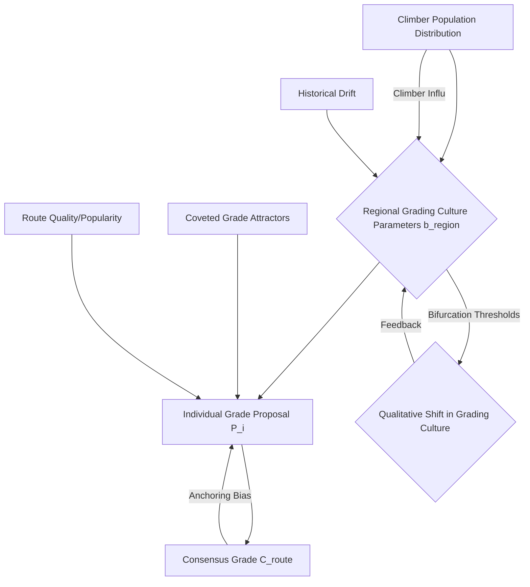

## Dynamical Systems Bifurcations in Regional Grading Culture via Climber Influx

**Category:** DEEP+BLOCKED | **First identified:** Round 2

### Research background
This research direction investigates the non-linear dynamics underlying the formation and evolution of regional rock climb grading cultures. The system is characterized by heterogeneous climbers proposing grades for routes, influenced by individual biases, psycho-physical limits, and social anchoring to existing consensus grades. The consensus grade itself is an emergent property, a running average of these proposals. Regional grading cultures manifest as distinct intercepts 'b' in the Darth Grader linear model $Y = a \cdot X + b$, implying systematic differences in how perceived difficulty maps to a numerical grade across geographical areas.

Key tensions from the synthesis history highlight the need for this direction:
*   **Bayesian Inference vs. Dynamical Systems (Round 1):** Bayesian approaches often treat individual biases as stable latent parameters, implying a static underlying system. In contrast, Dynamical Systems proposes that such biases, especially when aggregated, can drive bifurcations and discontinuous shifts in the grading system. This direction aims to reconcile this by exploring how parameter changes (e.g., in climber demographics) can lead to qualitative shifts in grading norms.
*   **Stochastic Process Modeler vs. Dynamical Systems (Round 1):** While grade stabilization can be viewed as a first-passage time problem, the Dynamical Systems perspective emphasizes "sticky attractors" at coveted grade thresholds (7a, 8a). This suggests stabilization might not be a simple monotonic process but influenced by the underlying potential landscape of the grade space. This direction will investigate how these attractors interact with regional culture shifts.

A significant blind spot identified in Round 2 was the influence of specific rock type or climbing style on grading mechanics. While this direction does not directly address those physical aspects, it does provide a robust framework to observe the *consequences* of such differences if they contribute to regional distinctiveness.

The core idea is that regional grading cultures are not static but exist as stable equilibria within a dynamic system, capable of undergoing sudden, qualitative changes (bifurcations) under certain conditions. The influx of new climbers or changes in the ability distribution within a region (or across regions due to migration) are prime candidates for such driving forces.



### Direction proposal
This direction proposes to model regional grading cultures as stable equilibria within a non-linear dynamical system. The central hypothesis is that changes in the composition or influx of climbers within a region can act as control parameters, driving the system through bifurcations, leading to abrupt shifts from one grading norm (e.g., "hard" grading) to another ("soft" grading). We will investigate these transitions using difference equations or Ordinary Differential Equations (ODEs) that describe the evolution of a region's grading intercept $b$.

Let $b_j(t)$ be the grading intercept for region $j$ at time $t$. We model its evolution as:
$$
\frac{db_j}{dt} = f(b_j, \mathbf{X}_j(t), \mathbf{M}_j(t))
$$
where $\mathbf{X}_j(t)$ represents local factors such as the ability distribution of climbers in region $j$ and the frequency of ascents, and $\mathbf{M}_j(t)$ represents influx of climbers, either new to climbing or migrating from other regions.

A specific focus will be on saddle-node or transcritical bifurcations, where a stable equilibrium (a regional grading culture) emerges, disappears, or changes its stability as a control parameter (e.g., the proportion of "soft" graders in the incoming population, or the average ability of local climbers) crosses a critical threshold.

The function $f$ will incorporate:
1.  **Anchoring towards a regional norm:** A tendency for $b_j$ to revert to its current average, representing the "cultural inertia."
2.  **Influence of individual proposals:** How individual proposals (biased by current $b_j$ and individual preferences/abilities) contribute to updating $b_j$.
3.  **Impact of climber influx:** New climbers, or climbers from other regions with different $b_{k}$ values, will introduce a perturbation term to $b_j$.

Specifically, we can consider a simplified model where $b_j$ is influenced by the average personal grade deviation $\Delta G_{avg, j}$ in the region:
$$
\frac{db_j}{dt} = \alpha \cdot \Delta G_{avg, j} - \beta \cdot (b_j - b_{target}) + \gamma \cdot N_{influx} \cdot (b_{influx} - b_j)
$$
where $\alpha, \beta, \gamma$ are positive rate constants, $b_{target}$ is an intrinsic regional target (e.g., historical norm), $N_{influx}$ is the rate of climber influx, and $b_{influx}$ is the average grading intercept of the incoming climbers. This formulation allows for competition between internal dynamics, historical anchors, and external influences. Bifurcations will arise from non-linearities in $\Delta G_{avg, j}$'s dependence on $b_j$ and $\mathbf{X}_j(t)$, or from the interaction term with $N_{influx}$.

```mermaid
graph TD
    A[Initial Regional Intercept b_j(t_0)] --> B(Climber Influx Rate N_influx);
    A --> C(Ability Distribution X_j(t));
    A --> D(Anchoring Parameter alpha);
    A --> E(Historical Target b_target);
    B --> F{Regional Grade Dynamics db_j/dt};
    C --> F;
    D --> F;
    E --> F;
    G[Grade Proposals from New Climbers b_influx] --> F;
    F --> H[Evolved Regional Intercept b_j(t+dt)];
    H --Feedback Loop--> A;
    F --Critical Threshold--> I{Bifurcation Event};
    I --> J[New Stable Grading Culture Equilibrium];
```

### Why this direction
This direction is scientifically promising because it directly addresses the fundamental question of *how* regional grading cultures emerge and, more importantly, *how they can change discontinuously*. This goes beyond merely quantifying grade drift or spatial correlations. It offers a mechanism-based explanation for the "hard" vs. "soft" reputation of crags and regions, and how these reputations might flip.

It directly addresses the tension between **Bayesian Inference** (stable latent parameters) and **Dynamical Systems** (bifurcations) from Round 1 by providing a framework where aggregated individual biases (which Bayesian methods can estimate) can lead to system-level phase transitions. It also complements the **Evolutionary Dynamics / Cultural Evolution** perspective (Round 1, Round 3, Metapopulation Dynamics) by providing a mechanistic, process-based explanation for the "founder effects" and "gene flow" dynamics discussed, interpreting them as initial conditions and perturbation terms within a continuous dynamical system rather than discrete population changes. The "founder effects" in metapopulation dynamics can be reinterpreted as initial conditions defining the early basin of attraction for a regional grade, making it resistant to later "gene flow" even if the average individual proposal changes (Dynamical Systems debate in Round 2).

A successful outcome would demonstrate that observable, sudden shifts in regional grading norms can be modeled as bifurcations driven by measurable changes in climber demographics or influx patterns. This would constitute a genuine scientific contribution by moving from descriptive observation (e.g., "this crag is soft") to predictive understanding (e.g., "if climber influx from region X continues at rate Y, this crag is likely to transition to soft grading within Z years"). This question is genuinely open because existing models tend to focus on statistical correlations or continuous drift, not on the conditions for discontinuous, qualitative shifts in grading culture.

### Evidence from the session
This direction is primarily championed by the **Dynamical Systems** agent throughout the session:

*   **Initial Generation (Round 1):** The agent "investigates bifurcations in regional grading cultures by modeling consensus grade evolution with difference equations," specifically analyzing "how factors like new climber influx or influential first ascentionists can lead to discontinuous shifts... via saddle-node or transcritical bifurcations." This lays the foundational concept.
*   **Reflection-Extended Directions (Round 2):** The agent further develops this, proposing to "Model regional grading culture transitions using stochastic bifurcations. Noise in proposals and climber arrivals can induce switches between 'hard' and 'soft' grading equilibria." This introduces stochasticity, acknowledging the inherent randomness in individual proposals and influx. It also hypothesizes that "routes exhibiting the 'slash' phenomenon operate near critical points