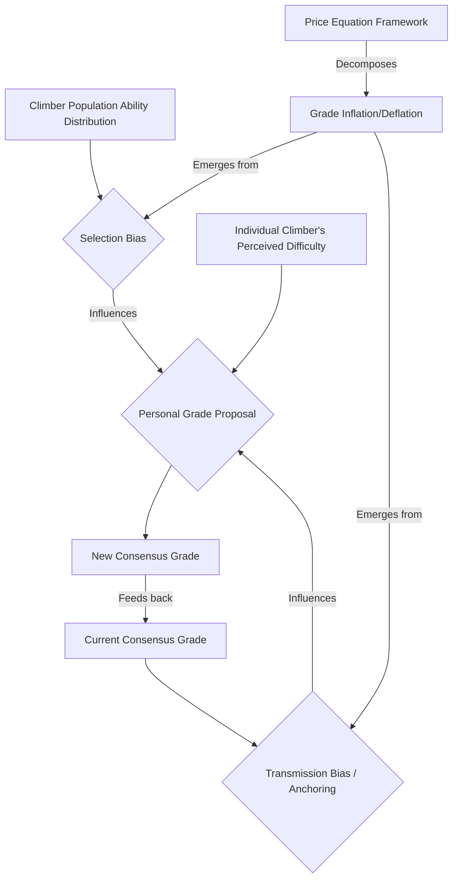

## Decomposing Grade Inflation/Deflation into Selection vs. Transmission Bias via Price Equation

**Category:** DEEP+TRACTABLE | **First identified:** Round 1

### Research background
The dynamics of rock climb difficulty grading systems present a complex interplay of individual perception, social influence, and population-level shifts. A persistent challenge is understanding the mechanisms behind "grade inflation" (routes feeling easier over time) or "deflation" (routes feeling harder). While climbers often observe these phenomena, the underlying drivers remain debated.

Two primary mechanisms have been hypothesized within the swarm to contribute to grade inflation/deflation:
1.  **Selection Bias:** Changes in the population of climbers attempting a route. If higher-ability climbers increasingly attempt and propose grades for a route, their proposals might systematically be lower, pulling the consensus grade downwards (deflation). Conversely, if a route becomes more accessible to lower-ability climbers, their proposals might be systematically higher (inflation). This relates to the "systematic selection bias: harder routes exclude lower-ability climbers from voting" system characteristic.
2.  **Transmission Bias (Anchoring/Social Herding):** The process by which individual grade proposals are influenced by the existing consensus grade and recent proposals. Climbers do not propose grades in a vacuum; their proposals are biased by social information. If this transmission process systematically shifts proposals in one direction, it can lead to grade inflation or deflation irrespective of changes in the climber population. This is explicitly tied to the system characteristic: "Personal grade proposals are biased by the known consensus grade and recent proposals (anchoring/social herding)."

The Stochastic Process Modeler initially suggested that "grade drift as a diffusion phenomenon amplified by non-uniform sampling" (Round 1, Stochastic Process Modeler, Initial Generation), implying a connection to selection bias from skewed ability. In tension, the Evolutionary Dynamics agent "attributes it to transmission bias or selection bias" (Round 1, Synthesis, Tensions). The Price equation offers a rigorous framework to formally disentangle these two contributions, providing a powerful resolution to this core tension.

A blind spot identified in Round 1 was the influence of route quality ratings on grade perception. While not directly integrated into the Price equation's core decomposition, this could serve as a covariate in subsequent analyses of grade stability or rate of drift.

The grade scale itself is discrete (e.g., 6a, 6a+, 6b), but difficulty is conceptually continuous. The observed grade for a route, $G_r$, is an emergent property of the voting system. Grade inflation/deflation refers to systematic changes in this $G_r$ over time, $G_r(t)$.



### Direction proposal
This direction proposes to formally decompose the observed temporal change in a route's consensus grade ($G_r$) into two distinct components: changes due to selection bias (changes in the average ability of climbers attempting the route) and changes due to transmission bias (anchoring/social herding effects on individual grade proposals). This will be achieved through the application of the Price equation.

The core research question is: What are the relative empirical magnitudes of selection bias and transmission bias in driving grade inflation/deflation within community rock climbing difficulty grading systems?

The Price equation, typically used in evolutionary biology to describe changes in mean phenotypic values over time, can be adapted to analyze the evolution of a consensus grade. Let $G_r(t)$ denote the consensus grade for route $r$ at time $t$. Let $\mathcal{A}_t$ be the population of climbers who successfully attempt route $r$ and propose a grade in a given time interval (e.g., month, year).
The mean consensus grade across all routes (or a specific route $r$ over time) can be expressed as $\bar{G}(t)$.

The general form of the Price equation is:
$$ \Delta \bar{z} = \frac{1}{N} \sum_i E[ \Delta z_i | z_i ] + \frac{1}{N} \sum_i \Delta N_i E[z_i] $$
Or, in its more commonly recognized form that separates selection and transmission:
$$ \Delta \bar{G} = E_P[ \Delta G_P ] + Cov_P(G_P, w_P) $$
where $\bar{G}$ is the mean grade, $G_P$ is the grade assigned by a climber (phenotype), and $w_P$ is the "fitness" or "contribution" of that grade.

For our purpose, we will adapt a form that decomposes the change in the *average grade proposed* by climbers on a route over a time interval $\Delta t$:
Let $\bar{G}_t$ be the average personal grade proposed by climbers successfully completing route $r$ in time interval $t$.
Let $P_i$ be the personal grade proposal of climber $i$, and $C_t$ be the consensus grade at time $t$.
We can define the change in the average proposed grade over time, $\Delta \bar{G} = \bar{G}_{t+1} - \bar{G}_t$.

This change can be decomposed as:
$$ \Delta \bar{G} = \frac{1}{N_t} \sum_{i \in \mathcal{A}_{t+1}} (G_{i,t+1} - G_{i,t}) + \frac{1}{N_t} \sum_{i \in \mathcal{A}_{t+1}} (G_{i,t} - \bar{G}_t) - \frac{1}{N_t} \sum_{j \in \mathcal{A}_t \setminus \mathcal{A}_{t+1}} (G_{j,t} - \bar{G}_t) $$
Where $N_t$ is the number of ascents in $\mathcal{A}_t$.
More directly applicable to grade dynamics, the Price equation can decompose the change in the mean grade $\bar{G}$ of a population into a transmission component (intra-individual grade change, i.e., how individuals change their proposals) and a selection component (differential contribution of individuals to the population mean):

$$ \Delta \bar{G} = E_{A_t}[\Delta G_i] + Cov(G_{i,t}, w_i) $$
Here, $\bar{G}$ represents the average personal grade proposed for a given route over a specific time period.
*   $E_{A_t}[\Delta G_i]$: The "transmission bias" component. This term captures the average change in grade proposals *per climber* from one period to the next. In the context of grading, this represents how a climber's proposed grade $G_i$ changes over time, potentially due to anchoring to the evolving consensus $C_t$. This captures the "how does an individual's grading behavior change?" aspect.
*   $Cov(G_{i,t}, w_i)$: The "selection bias" component. This term represents the covariance between a climber's proposed grade $G_{i,t}$ and their "fitness" ($w_i$). Here, $w_i$ can be defined as the *proportional contribution* of climber $i$ to the next generation's population of graders for that route. If higher-ability climbers (who tend to propose lower grades for a given route) contribute more ascents over time, this term will be negative, indicating deflation due to selection. Conversely, if lower-ability climbers (who tend to propose higher grades) increase their representation, this term will be positive, indicating inflation due to selection. This captures the "who is doing the grading?" aspect.

This framework directly addresses the contradiction between the Stochastic Process Modeler (grade inflation as diffusion from skewed ability) and Evolutionary Dynamics (grade inflation as selection or transmission bias) by formalizing both mechanisms.

```mermaid
graph TD
    A[Raw Ascent Data: (Ascentionist ID, Date, Personal Grade, Consensus Grade, Route ID, Location)] --> B{Group by Route & Time Interval (e.g., month)}
    B --> C{Calculate Average Personal Grade (G_bar) per Route per Interval}
    B --> D{Track Individual Climber Contributions (w_i) per Route per Interval}
    B --> E{Track Individual Grade Proposal Changes (Delta G_i) for Repeat Ascenders}
    C --> F[Calculate Delta G_bar]
    E --> G[Calculate E[Delta G_i] (Transmission Bias Term)]
    D & C --> H[Calculate Cov(G_i, w_i) (Selection Bias Term)]
    G & H --> I[Price Equation Decomposition: Delta G_bar = E[Delta G_i] + Cov(G_i, w_i)]
    I --> J[Quantify Relative Contributions of Selection vs. Transmission Bias]
```

### Why this direction
This direction is scientifically promising because it offers a precise, quantitative method to resolve a fundamental open question (Open Question 2: Is grade inflation primarily driven by selection bias or by anchoring/transmission bias in grade proposals?) identified in Round 1 and consistently highlighted in subsequent syntheses. By applying the Price equation, we move beyond qualitative attribution to a formal decomposition, yielding empirical magnitudes for each component.

Specifically:
*   **Resolves a core contradiction:** The contradiction identified in Round 1 and re-iterated in Round 2 and 3 ("Stochastic Process Modeler vs Evolutionary Dynamics: Grade inflation is diffusion from skewed ability | Grade inflation is selection or transmission bias | Resolution needed: Decompose using Price equation") is directly addressed. This direction integrates the insights from both perspectives by providing a framework to quantify the impact of both population composition changes (selection bias) and individual proposal adjustments (transmission bias).
*   **Fills a methodological gap:** While anchoring and individual bias have been proposed for quantification using hierarchical Bayesian models (Round 1, Bayesian Inference, Initial Generation), and grade drift as a diffusion phenomenon (Round 1, Stochastic Process Modeler, Initial Generation), no framework has been proposed to *decompose* these effects into population-level shifts and individual-level transmission. The Price equation provides this unique capability.
*   **Provides empirical magnitudes:** A successful outcome would not only identify the drivers but also provide their empirical strength, e.g., "X% of grade inflation for route R is explained by selection bias, and Y% by transmission bias." This level of quantitative insight is a significant scientific contribution.
*   **Leverages existing data:** The required data (Ascentionist identity, Date of ascent, Personal grade proposed, Consensus grade at time of ascent) are all available in the provided dataset, making this a tractable direction.

Understanding the primary drivers of grade inflation/deflation has significant implications for:
1.  **Grade scale stability:** Informing how grading systems might be designed or managed to mitigate unwanted drift.
2.  **Comparative crag analysis:** Explaining why some crags exhibit more drift than others (e.g., due to different climber demographics or social influence strength).
3.  **Historical analysis:** More accurately interpreting historical grades and their evolution.

### Evidence from the session
The concept of decomposing grade inflation/deflation into selection versus transmission bias via the Price equation was consistently championed by the **Evolutionary Dynamics / Cultural Evolution** agent across all rounds:

*   **Round 1, Evolutionary Dynamics / Cultural Evolution, Initial Generation:** "a Price equation decomposition is proposed to disentangle grade inflation/deflation into components of transmission bias (anchoring) and selection bias (changes in the climber population's ability). This method directly addresses Open Question 2 using ascent data." This is the foundational proposal for this direction.
*   **Round 2, Evolutionary Dynamics / Cultural Evolution, Reflection-Extended Directions:** The agent continued to advocate for this by suggesting "replicator-mutator dynamics to grade proposals, treating consensus as selection pressure and individual biases/anchoring as mutation," further linking individual-level changes (transmission) to population-level outcomes (selection).
*   **Round 3, Evolutionary Dynamics / Cultural Evolution, Reflection-Extended Directions:** The agent extended this to "multilevel selection framework for grading strategies, decomposing changes in grading accuracy norms," which implies a more complex Price equation structure for hierarchical decomposition. This reinforces the core idea of breaking down grade evolution into components attributable to different mechanisms.
*   **Round 3, Synthesis, Convergences:** "The need to distinguish between individual grading biases and collective, emergent grading norms is a recurring theme," implicitly supporting a decomposition method like the Price equation.
*   **Round 3, Synthesis, Research Directions:** "[DEEP+TRACTABLE] Disentangling grade inflation drivers using Price equation decomposition and SDEs" directly names and prioritizes this research direction, indicating strong consensus for its tractability and scientific depth.

The contradiction tracker consistently noted the need for this decomposition: "Stochastic Process Modeler vs Evolutionary Dynamics: Grade inflation is diffusion from skewed ability — vs — Grade inflation is selection or transmission bias | Resolution needed: Decompose using Price equation" (Round 1, Contradiction Tracker). This highlights the Price equation as the designated solution to a central theoretical conflict.

### Required data and methods

**1. Ascent Data:**
*   **Required Fields:** `Ascentionist identity`, `Date of ascent`, `Personal grade proposed by the ascentionist`, `Consensus grade at the time of ascent`, `Location of the climb (crag, region, country)`, `Route ID` (to link ascents to a specific route).
*   **Availability:** Available from 8a.nu and ukclimbing.com/logbook/ (brief states "anticipated to be obtainable via a polite request").
*   **Methodological Prerequisites:** Data cleaning and preprocessing to ensure unique route identification, consistent grade parsing, and time-stamped records. Crucially, reliable mapping of `Ascentionist identity` across multiple ascents on the *same route* is needed to track individual grade proposal changes ($\Delta G_i$).

**2. Climber Ability Data (Inferred):**
*   **Required Fields:** Not directly available, but can be inferred. A proxy for climber ability could be the average grade of routes a climber successfully sends, or a more sophisticated ELO-like rating derived from their full ascent history (this is part of the `Quantifying Anchoring and Individual Bias in Grade Proposals with Hierarchical Bayesian Models` direction, and `Co-evolution of latent difficulty and grade consensus via dynamic Bayesian modeling`).
*   **Availability:** Inferable from `Ascentionist identity` and their `Personal grade proposed` across *all* routes in the dataset.
*   **Methodological Prerequisites:** An ability estimation model (e.g., a simple average or a hierarchical Bayesian IRT model as proposed by the Bayesian Inference agent in Round 1 and Round 2) to assign an ability score to each climber. This is a non-trivial technical dependency, as the accuracy of the ability estimation directly impacts the `Cov(G_{i,t}, w_i)` term.

**3. Price Equation Application:**
*   **Method:** Statistical application of the Price equation to temporal sequences of ascent data for individual routes or aggregated by region/grade.
*   **Prerequisites:**
    *   **Defining the "population":** This could be all ascents on a specific route over a time window, or all ascents within a specific grade band in a region.
    *   **Defining "generations" or time steps:** The time interval $\Delta t$ for computing changes ($\Delta \bar{G}$, $\Delta G_i$, $w_i$) needs to be carefully chosen (e.g., monthly, quarterly, yearly).
    *   **Measuring $G_{i,t}$ and $\Delta G_i$:** $G_{i,t}$ is the personal grade proposed by climber $i$ at time $t$. $\Delta G_i$ requires identifying climbers who have ascended the same route in consecutive time intervals. If a climber only proposes a grade once for a route, their $\Delta G_i$ for that route-specific definition of "population" would be undefined, and they would primarily contribute to the selection term (by affecting the composition of the grading population).
    *   **Measuring $w_i$ (fitness/contribution):** $w_i$ can be defined as the *relative frequency* of climber $i$'s ascents within a given time window, or their *proportional representation* in the set of graders for the next time window. A more nuanced $w_i$ could incorporate the influence of their proposed grade on the consensus (e.g., weighted by a measure of their influence or expertise, if available or inferable). The simplest definition is $w_i = N_{i, t+1} / N_t$, where $N_{i, t+1}$ is the number of ascents by climber $i$ in the next time step, and $N_t$ is the total number of ascents in the current time step.

**4. Combination with Hierarchical Bayesian Models:**
*   **Dependency:** This direction would benefit from methodological synergy with "[DEEP+TRACTABLE] Quantifying Anchoring and Individual Bias in Grade Proposals with Hierarchical Bayesian Models" (Round 1). The Bayesian framework could be used to more robustly estimate individual climber biases, which could then refine the interpretation of $G_{i,t}$ or inform the definition of $w_i$.
*   **Technical Dependency:** A dynamic hierarchical Bayesian model for individual proposals (Round 2, Bayesian Inference, Reflection-Extended Directions; Round 3, Dynamic Hierarchical Bayesian Ordinal Probit model) would provide more sophisticated estimates of $\Delta G_i$ that account for latent true difficulty and individual anchors.

### Immediate next steps

1.  **Define Price Equation Terms:** Formalize the exact definitions of $\bar{G}$, $G_i$, $\Delta G_i$, and $w_i$ for an individual route over discrete time intervals. Consider different ways to operationalize these terms from the raw ascent data (e.g., how to handle climbers who grade a route only once).
2.  **Mock Data Simulation:** Generate synthetic ascent data for a single route over a simulated period with known selection and transmission biases. Implement the Price equation decomposition on this mock data to verify the methodology can accurately recover the known biases. This will establish confidence in the chosen operational definitions.
3.  **Data Request Formulation:** Draft a precise data request to 8a.nu/UKClimbing specifying the required fields (`Ascentionist identity`, `Date of ascent`, `Personal grade proposed`, `Consensus grade at time of ascent`, `Location`, `Route ID`).

### Research programme

#### Phase 1 — Groundwork
*   **Objective:** Establish robust operational definitions for Price equation terms and validate the decomposition method with synthetic data.
*   **Tasks:**
    1.  **Formalize Operational Definitions:** Develop clear, unambiguous definitions for $\bar{G}$, $G_i$, $\Delta G_i$, and $w_i$ based on the available ascent data. Consider how to handle missing data for $\Delta G_i$ (climbers who grade a route only once) and what constitutes a "population" for the Price equation (e.g., all ascents on a specific route, all ascents within a grade range at a crag).
    2.  **Synthetic Data Generation:** Create a simulator for route ascents that allows controlled injection of selection bias (e.g., a shift in the mean ability of climbers attempting a route over time) and transmission bias (e.g., a consistent upward or downward pull of individual proposals relative to the consensus).
    3.  **Method Validation:** Implement the Price equation decomposition on the synthetic data. Verify that the decomposed components accurately reflect the known simulated biases.
    4.  **Initial Data Acquisition & Preprocessing:** Obtain a sample of the actual ascent data. Develop robust parsing and cleaning pipelines for `Ascentionist identity`, `Date`, `Grades`, and `Route ID`.
*   **Deliverable:** A validated Price equation decomposition script (e.g., in Python or R) capable of recovering known biases from synthetic data, along with a cleaned, preprocessed subset of real ascent data.

#### Phase 2 — Core contribution
*   **Objective:** Empirically quantify the relative contributions of selection and transmission bias to grade inflation/deflation using real-world data.
*   **Tasks:**
    1.  **Climber Ability Estimation:** Implement a preliminary model to estimate individual climber abilities (e.g., simple average of their highest redpoint grade, or an ELO-like system). This ability proxy will be crucial for interpreting changes in the grading population.
    2.  **Route-Level Decomposition:** Apply the validated Price equation decomposition to a diverse sample of routes from the acquired dataset. Analyze routes that exhibit significant grade drift (inflation or deflation) over time.
    3.  **Aggregated Analysis:** Aggregate the decomposition results by `region`, `grade band`, and `route popularity` to identify systematic patterns. For example, do popular routes show more transmission bias? Do newer crags show more selection bias initially?
    4.  **Statistical Inference:** Develop statistical tests to assess the significance of the decomposed components and their variation across different route characteristics.
*   **Deliverable:** A comprehensive empirical analysis demonstrating the relative contributions of selection and transmission bias to grade inflation/deflation across various contexts, including statistical measures of their magnitudes and confidence intervals. This will directly address Open Question 2.

#### Phase 3 — Extension and consolidation
*   **Objective:** Generalize findings, explore nuances, and integrate with other theoretical frameworks.
*   **Tasks:**
    1.  **Refined Ability Estimation:** Integrate a more sophisticated ability model, potentially from the "Dynamic Bayesian Inference of Anchoring and Coveted Grade Attractors" direction, to improve the accuracy of the selection bias term.
    2.  **Multilevel Price Equation:** Extend the decomposition to a multilevel framework (as suggested by the Evolutionary Dynamics agent in Round 3), allowing for simultaneous analysis of individual climber-level evolution and community/regional grading culture evolution. This could shed light on "regional grading cultures differ systematically."
    3.  **Influence of Coveted Grades:** Investigate whether the relative contributions of selection and transmission bias change around "coveted grade thresholds" (7a, 8a, 9a), relating to Open Question 4.
    4.  **Spatial Dynamics:** Analyze how the Price equation components vary geographically, linking to the "Metapopulation Dynamics of Regional Grading Cultures and Climber Migration" direction (Round 1, Evolutionary Dynamics).
*   **Potential Outputs:**
    *   A peer-reviewed scientific publication detailing the Price equation decomposition method and its empirical application to rock climbing grading.
    *   A public data analysis repository with the code and (anonymized) results.
    *   Contributions to a guidebook or platform explaining grade dynamics to climbers.

### Known obstacles

1.  **Defining $\Delta G_i$ for Infrequent Graders:** Many climbers will only grade a specific route once. For these climbers, $\Delta G_i$ is undefined within the context of that single route.
    *   **Resolution proposed in session:** None explicitly for this specific issue, but the Price equation allows for some flexibility in defining the "population" and "generations."
    *   **Remaining challenge:** A careful choice of time interval $\Delta t$ and definition of $\Delta G_i$ (e.g., using a climber's *global* change in grading tendency, or focusing on repeat ascenders) will be necessary. Alternatively, the formulation might focus on the change in *average proposed grade*, where individuals may enter and exit the "population" of graders.
2.  **Attributing $w_i$ to "Fitness":** The concept of "fitness" in the Price equation is about differential contribution. Operationalizing this in a climbing context where climbers don't "reproduce" grades directly requires careful thought.
    *   **Resolution proposed in session:** The Evolutionary Dynamics agent (Round 1, Initial Generation) implies $w_i$ relates to "changes in the climber population's ability" or "proportional contribution."
    *   **Remaining challenge:** While simple frequency of ascent is a starting point, more nuanced definitions of $w_i$ that capture actual influence on the consensus (e.g., weighting by perceived expertise or social network centrality, if such data could be inferred) might be desirable but are more complex.
3.  **Discretization of Grades:** The French grading scale is discrete, while the Price equation typically operates on continuous phenotypes.
    *   **Resolution proposed in session:** The Bayesian Inference agent (Round 3, Reflection-Extended Directions) proposes "Dynamic Hierarchical Bayesian Ordinal Probit model. This models discrete grade proposals as ordinal outcomes from latent continuous difficulty." This suggests a way to treat discrete grades as manifestations of an underlying continuous process.
    *   **Remaining challenge:** Direct application of the Price equation to discrete grades might introduce biases. Using the underlying continuous difficulty inferred by an ordinal model could be a more robust approach, but it adds a methodological dependency.
4.  **Temporal Granularity:** Choosing an appropriate time interval $\Delta t$ for computing $\Delta \bar{G}$, $\Delta G_i$, and $w_i$ is crucial. Too short, and the population turnover might be too high; too long, and dynamic changes might be smoothed out.
    *   **Resolution proposed in session:** None explicitly.
    *   **Remaining challenge:** This will likely require empirical exploration and sensitivity analysis to determine the optimal $\Delta t$ for different routes or crags.

### Related directions
*   **[DEEP+TRACTABLE] Quantifying Anchoring and Individual Bias in Grade Proposals with Hierarchical Bayesian Models:** This direction is highly complementary. The Bayesian models can provide robust estimates of individual climber biases and the anchoring coefficient, which are directly relevant to parameterizing and interpreting the transmission bias component of the Price equation. It also can help infer a "true" latent difficulty for routes, which could serve as a more continuous "phenotype" for the Price equation.
*   **[DEEP+TRACTABLE] Metapopulation Dynamics of Regional Grading Cultures and Climber Migration:** This direction offers a macro-level view of how grading norms propagate. Combining it with the Price equation could reveal how the relative contributions of selection and transmission bias differ across regions and how they are influenced by climber migration, providing a mechanistic link between micro-level grading behavior and macro-level regional norms.
*   **[SHALLOW+TRACTABLE] Quantifying Impact of Skewed Ability Distribution on Grade Drift:** This direction directly addresses the selection bias component. Insights from this can inform the definition and interpretation of the $Cov(G_{i,t}, w_i)$ term in the Price equation, making the overall decomposition more robust.